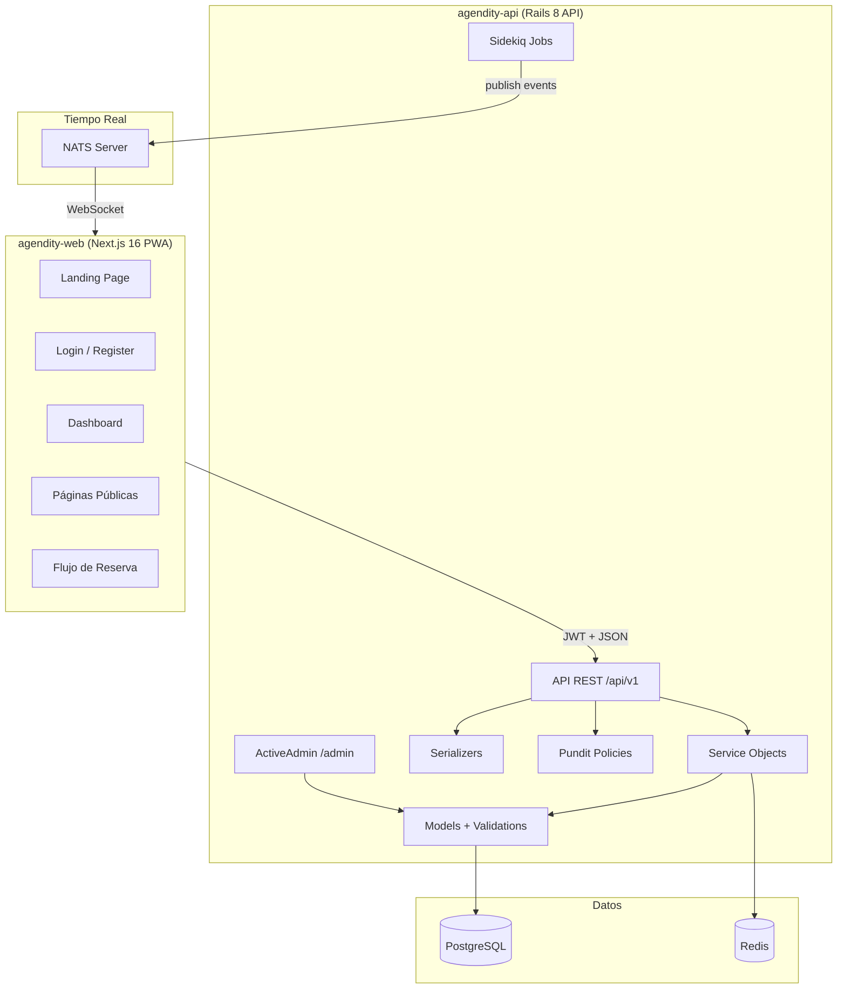

# Documentación Técnica — Agendity

> Última actualización: 2026-03-17
> Documentación final pre-lanzamiento
> **Fase del proyecto:** Pre-lanzamiento

## Índice

| Documento | Descripción |
|---|---|
| [base-de-datos-v1.md](base-de-datos-v1.md) | Esquema de base de datos (ERD, 19 tablas, relaciones) |
| [api-contracts-v1.md](api-contracts-v1.md) | Contratos API REST (62 endpoints con request/response) |
| [frontend-architecture.md](frontend-architecture.md) | Arquitectura del frontend Next.js 16 PWA (109 archivos TS/TSX) |
| [autenticacion-jwt.md](autenticacion-jwt.md) | Flujo JWT completo: login → token → cookie sync → middleware |
| [sistema-pagos-p2p.md](sistema-pagos-p2p.md) | Sistema de pagos P2P: comprobantes, aprobación, estados |
| [sistema-planes.md](sistema-planes.md) | Planes de suscripción: restricciones, UI, badge, upgrade |
| [setup-local.md](setup-local.md) | Guía de setup local para desarrollo (Rails + Next.js + Redis + NATS) |
| [concurrencia-slots.md](concurrencia-slots.md) | Protección contra double-booking: Redis lock + SELECT FOR UPDATE + unique index |
| [notificaciones.md](notificaciones.md) | Sistema de notificaciones: in-app, email, jobs, schedulers |
| [nats-realtime.md](nats-realtime.md) | Sistema de tiempo real: NATS, WebSocket, notificaciones del navegador, sonido |
| [sistema-cancelaciones.md](sistema-cancelaciones.md) | Sistema de cancelaciones y penalizaciones: reglas, cálculo, endpoints, flujo |
| [sistema-soporte.md](sistema-soporte.md) | Sistema de soporte por plan: canales (email, WhatsApp, chat), pendientes |
| [admin-superadmin.md](admin-superadmin.md) | Flujos de admin y superadmin: ActiveAdmin, dashboard, background jobs, diagramas |
| [flujos-completos.md](flujos-completos.md) | Diagramas Mermaid completos: ciclo de reserva, mapa de actores, maquina de estados, cancelacion, pagos |
| [sistema-ubicaciones.md](sistema-ubicaciones.md) | Sistema de ubicaciones geográficas: gema city-state, API locations, cascading selects |
| [cierre-de-caja.md](cierre-de-caja.md) | Cierre de caja: comisiones, deuda acumulada, comprobantes, resumen neto (Profesional+) |
| [portal-empleado.md](portal-empleado.md) | Portal del empleado: invitacion, registro, dashboard, check-in con sustituto, score, QR scanner |
| [sistema-creditos-cashback.md](sistema-creditos-cashback.md) | Creditos y cashback: modelos, servicios, endpoints, bulk adjust, integracion con cancelaciones (Profesional+) |
| [tarifas-dinamicas.md](tarifas-dinamicas.md) | Tarifas dinamicas: modos fijo/progresivo, incremento/descuento, IA, escalamiento a Claude API |
| [reportes-ganancias.md](reportes-ganancias.md) | Ganancias netas, penalty income, validacion de consistencia, ActiveAdmin financiero, dias cerrados |
| [env-variables.md](env-variables.md) | Variables de entorno: frontend (4) + backend (25), valores dev/prod, notas de seguridad |
| [decisiones/](decisiones/) | ADRs (Architecture Decision Records) |

### Decisiones técnicas (ADRs)

| ADR | Descripción |
|---|---|
| [001](decisiones/001-campos-eliminados-businesses.md) | Eliminar campos genéricos de pago (bank_account_info, payment_instructions) a favor de campos específicos (nequi, daviplata, bancolombia) |
| [002](decisiones/002-proteccion-concurrencia-slots.md) | Protección de concurrencia de slots con 3 capas: Redis lock + SELECT FOR UPDATE + unique index |
| [003](decisiones/003-nats-realtime.md) | NATS como sistema de mensajería real-time sobre Action Cable, MQTT y polling puro |
| [004](decisiones/004-encriptacion-datos-pago.md) | Encriptación de datos de pago (Nequi, Daviplata, Bancolombia) con Rails `encrypts` |
| [005](decisiones/005-ticket-code-siempre-generado.md) | ticket_code siempre generado independiente del plan (identificador operativo vs ticket VIP visual) |
| [006](decisiones/006-business-status-semantics.md) | Semántica de estados de negocio: active, suspended, inactive — significado, quién los cambia, efectos |

## Arquitectura general

