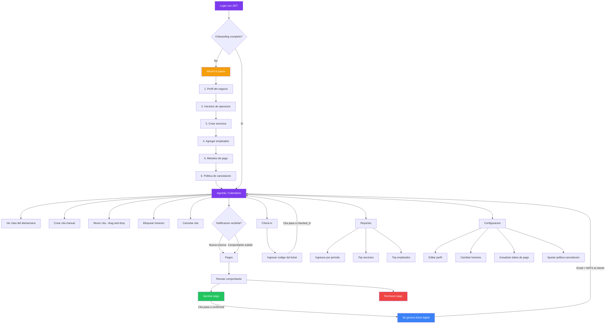
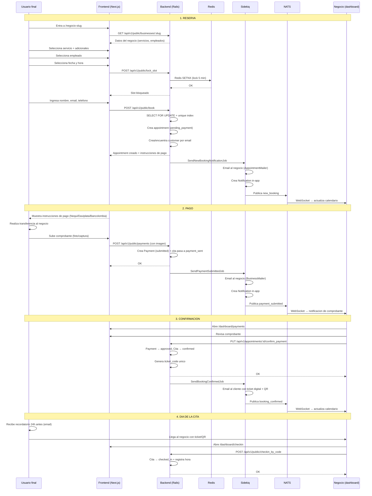
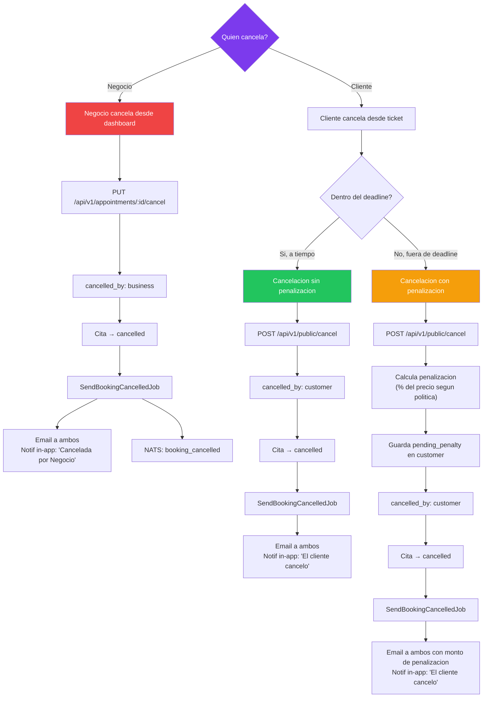
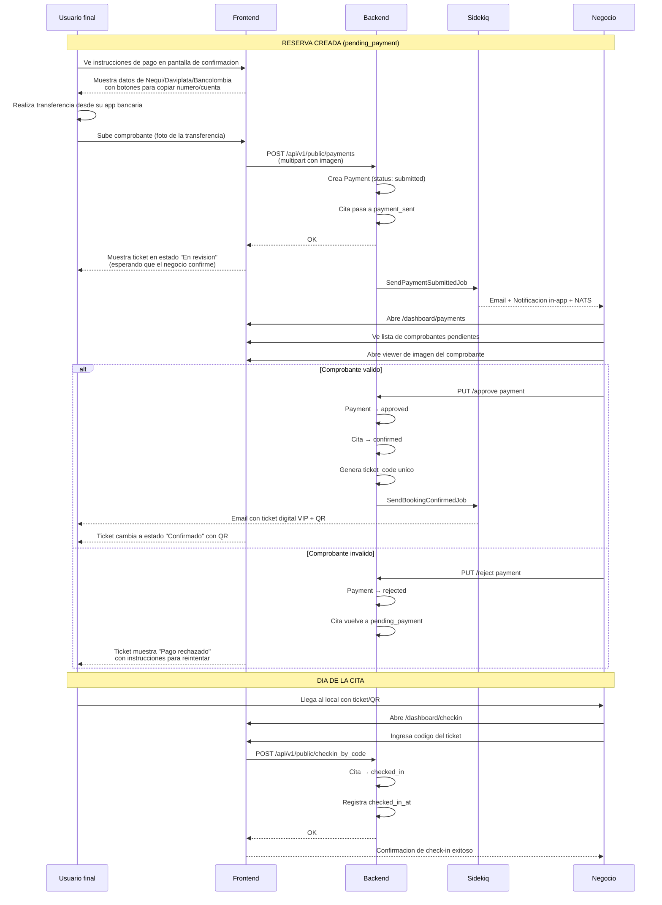

# Flujos de Admin y Superadmin — Agendity

> Ultima actualizacion: 2026-03-16
> **Fase del proyecto:** Pre-lanzamiento

Este documento describe los flujos completos del **Superadmin** (panel ActiveAdmin) y del **Admin del negocio** (dashboard Next.js), incluyendo todos los background jobs y diagramas de flujo.

---

## Tabla de contenido

1. [Superadmin (ActiveAdmin)](#1-superadmin-activeadmin)
2. [Admin del negocio (Dashboard)](#2-admin-del-negocio-dashboard)
3. [Background Jobs](#3-background-jobs)
4. [Flujos completos (diagramas mermaid)](#4-flujos-completos-diagramas-mermaid)

---

## 1. Superadmin (ActiveAdmin)

### 1.1 Acceso

| Dato | Valor |
|---|---|
| **URL** | `/admin` (redirige a `/admin/login`) |
| **Autenticacion** | Session-based (NO JWT). Controller: `Admin::SessionsController` |
| **Roles permitidos** | Solo usuarios con `role: admin` |
| **Logout** | `GET /admin/logout` |

El login valida email + password y verifica que el usuario tenga `role: admin`. La sesion se almacena en cookie de Rails (`session[:admin_user_id]`). Es un flujo completamente separado de la autenticacion JWT de la API.

**Archivos clave:**
- `app/controllers/admin/sessions_controller.rb` — Login/logout session-based
- `config/initializers/active_admin.rb` — Configuracion de ActiveAdmin

### 1.2 Dashboard principal

El dashboard (`/admin/dashboard`) muestra metricas globales de la plataforma en tiempo real:

**Panel "Platform Overview":**
- Total de negocios registrados
- Negocios activos
- Total de usuarios
- Total de citas
- Total de clientes (usuarios finales)

**Panel "Revenue":**
- Ingresos totales (pagos aprobados, historico)
- Ingresos del mes actual

**Panel "Recent Signups":**
- Tabla de los ultimos 10 negocios registrados en los ultimos 7 dias
- Columnas: nombre (link), tipo de negocio, ciudad, estado, fecha de registro

**Panel "Recent Appointments":**
- Tabla de las ultimas 10 citas creadas
- Columnas: negocio (link), cliente, fecha, estado

**Archivo:** `app/admin/dashboard.rb`

### 1.3 Recursos administrables

#### Negocios (`/admin/businesses`)

| Accion | Descripcion |
|---|---|
| **Listar** | Tabla con: nombre, slug, tipo, estado, owner (link), ciudad, rating, onboarding, fecha |
| **Ver detalle** | Todos los campos del negocio + panel de estadisticas (servicios, empleados, citas, clientes, resenas) |
| **Editar** | Todos los campos: nombre, tipo, estado, descripcion, contacto, direccion, datos de pago (nequi, daviplata, bancolombia), cancelacion, trial, onboarding, colores de marca |
| **Aprobar** | Boton visible cuando `status: inactive`. Cambia a `active` |
| **Suspender** | Boton visible cuando `status: active`. Cambia a `suspended` |
| **Activar** | Boton visible cuando `status: suspended`. Cambia a `active` |
| **Eliminar** | Accion estandar de ActiveAdmin |
| **Batch actions** | Seleccion multiple habilitada |

**Filtros disponibles:** nombre, estado, tipo de negocio, ciudad, onboarding completado, fecha de creacion.

**Estados de un negocio:**
- `active` (0) — Operando normalmente
- `suspended` (1) — Oculto del publico, dashboard funcional
- `inactive` (2) — Completamente deshabilitado

> Ver [ADR 006](decisiones/006-business-status-semantics.md) para la semantica completa de cada estado.

#### Badges de estado en ActiveAdmin

| Estado | Badge | Color |
|---|---|---|
| `active` | Activo | Verde |
| `suspended` | Oculto | Amarillo |
| `inactive` | Desactivado | Rojo |

#### Member actions (acciones individuales)

| Accion | Visible cuando | Resultado |
|---|---|---|
| **Approve** | `status: inactive` | Cambia a `active` |
| **Suspend** | `status: active` | Cambia a `suspended` |
| **Activate** | `status: suspended` | Cambia a `active` |

#### Batch actions (acciones en lote)

| Accion | Descripcion |
|---|---|
| **Activar** | Cambia los negocios seleccionados a `active` |
| **Ocultar** | Cambia los negocios seleccionados a `suspended` |

> **Regla fundamental:** Solo el SuperAdmin puede cambiar el estado de un negocio. El dueno del negocio NO puede cambiar su propio status. La falta de pago NO cambia el status — solo hace downgrade al Plan Basico.

**Archivo:** `app/admin/businesses.rb`

#### Usuarios (`/admin/users`)

| Accion | Descripcion |
|---|---|
| **Listar** | Tabla con: nombre, email, rol, telefono, fecha |
| **Ver detalle** | Datos del usuario + panel con sus negocios (nombre, tipo, estado, ciudad) |
| **Editar** | nombre, email, rol, telefono, password (opcional — se puede actualizar sin cambiar password) |
| **Crear** | Formulario completo con password |
| **Eliminar** | Accion estandar |
| **Batch actions** | Seleccion multiple habilitada |

**Roles disponibles:** `owner` (0), `admin` (1), `employee` (2)

**Filtros:** nombre, email, rol, fecha de creacion.

**Archivo:** `app/admin/users.rb`

#### Planes (`/admin/plans`)

| Accion | Descripcion |
|---|---|
| **Listar** | Tabla con: nombre, precio mensual, limites (empleados, servicios, reservas), features (IA, ticket, reportes) |
| **Ver detalle** | Todos los campos del plan |
| **Editar / Crear** | Dos secciones: "Plan Details" (nombre, precio, limites) + "Features" (IA, ticket digital, reportes avanzados, marca, listado destacado, soporte prioritario) |
| **Eliminar** | Accion estandar |

**Campos editables de un plan:**
- `name` — Nombre del plan (basico, profesional, inteligente)
- `price_monthly` — Precio mensual en COP
- `max_employees` — Limite de empleados
- `max_services` — Limite de servicios
- `max_reservations_month` — Limite de reservas por mes
- `max_customers` — Limite de clientes
- `ai_features` — Acceso a features de IA (boolean)
- `ticket_digital` — Ticket VIP digital (boolean)
- `advanced_reports` — Reportes avanzados (boolean)
- `brand_customization` — Personalizacion de marca/colores (boolean)
- `featured_listing` — Listado destacado en explore (boolean)
- `priority_support` — Soporte prioritario (boolean)

**Archivo:** `app/admin/plans.rb`

#### Suscripciones (`/admin/subscriptions`)

| Accion | Descripcion |
|---|---|
| **Listar** | Tabla con: negocio (link), plan (link), estado, fecha inicio, fecha fin |
| **Ver detalle** | Todos los campos |
| **Editar** | plan_id, estado, fecha inicio, fecha fin |

> **Nota:** No se puede crear suscripciones desde ActiveAdmin (solo editar). Las suscripciones se crean automaticamente cuando un negocio se registra (trial de 30 dias).

**Estados de suscripcion:** `active` (0), `expired` (1), `cancelled` (2)

**Filtros:** estado, plan, fecha inicio, fecha fin.

**Archivo:** `app/admin/subscriptions.rb`

#### Citas (`/admin/appointments`)

| Accion | Descripcion |
|---|---|
| **Listar** | Tabla con: negocio (link), cliente, servicio, empleado, fecha, hora, estado, precio |
| **Ver detalle** | Todos los campos incluyendo ticket_code, notas, razon de cancelacion, hora de check-in |

> **Nota:** Solo lectura (index + show). El superadmin NO puede crear ni editar citas.

**Estados de cita:** `pending_payment` (0), `payment_sent` (1), `confirmed` (2), `checked_in` (3), `cancelled` (4), `completed` (5)

**Filtros:** estado, negocio, fecha de cita, fecha de creacion.

**Archivo:** `app/admin/appointments.rb`

#### Resenas (`/admin/reviews`)

| Accion | Descripcion |
|---|---|
| **Listar** | Tabla con: negocio (link), nombre del cliente, rating, comentario (truncado 80 chars), fecha |
| **Ver detalle** | Negocio, nombre del cliente, cliente (link si existe), rating, comentario completo |

> **Nota:** Solo lectura. El superadmin puede ver pero NO crear/editar resenas.

**Filtros:** negocio, rating, fecha de creacion.

**Archivo:** `app/admin/reviews.rb`

#### Clientes (`/admin/customers`)

| Accion | Descripcion |
|---|---|
| **Listar** | Tabla con: negocio (link), nombre, email, telefono, fecha |
| **Ver detalle** | Datos del cliente + panel con sus ultimas 20 citas (fecha, servicio, estado, precio) |

> **Nota:** Solo lectura. Los clientes (usuarios finales) se crean automaticamente al hacer reservas.

**Filtros:** negocio, nombre, email, fecha de creacion.

**Archivo:** `app/admin/customers.rb`

#### Activity Logs (`/admin/activity_logs`)

| Accion | Descripcion |
|---|---|
| **Listar** | Tabla con: accion, actor (usuario o sistema), recurso afectado, detalles, fecha |
| **Ver detalle** | Datos completos del evento incluyendo cambios (before/after) |

> **Nota:** Solo lectura. Los activity logs se generan automaticamente al crear/modificar recursos clave (citas, pagos, negocios, suscripciones).

**Eventos registrados:**
- `booking_created` — Nueva reserva creada
- `booking_confirmed` — Pago aprobado, cita confirmada
- `booking_cancelled` — Cita cancelada (incluye `cancelled_by`)
- `payment_submitted` — Comprobante subido
- `payment_approved` — Pago aprobado
- `payment_rejected` — Pago rechazado
- `business_approved` — Negocio aprobado por superadmin
- `business_suspended` — Negocio suspendido
- `notification_sent` — Notificacion enviada (email/in-app)

**Filtros:** accion, actor, recurso, fecha.

#### Request Logs (`/admin/request_logs`)

| Accion | Descripcion |
|---|---|
| **Listar** | Tabla con: metodo HTTP, path, status code, IP, usuario (si autenticado), duracion (ms), fecha |
| **Ver detalle** | Headers, params (sanitizados), response body (truncado), user agent |

> **Nota:** Solo lectura. Los request logs se registran automaticamente para cada request a la API. Se limpian automaticamente despues de 30 dias via job programado.

**Filtros:** metodo, path, status code, usuario, IP, fecha.

**Job de limpieza:** `CleanupRequestLogsJob` — elimina logs con mas de 30 dias de antiguedad. Programado semanalmente.

#### Ordenes de pago de suscripcion (`/admin/subscription_payment_orders`)

| Accion | Descripcion |
|---|---|
| **Listar** | Tabla con: negocio (link), plan, monto, estado (pendiente/pagado/vencido), fecha de emision, fecha limite |
| **Ver detalle** | Datos completos de la orden + comprobante si existe |
| **Marcar como pagado** | Boton para confirmar recepcion del pago de suscripcion |

> **Nota:** Las ordenes se generan automaticamente cuando una suscripcion esta por vencer. El negocio paga directamente (modelo P2P, igual que las citas) y el superadmin confirma el pago manualmente.

**Estados de orden:** `pending` (pendiente), `paid` (pagado), `overdue` (vencido)

**Flujo:**
1. 5 dias antes del vencimiento de la suscripcion, se genera automaticamente una orden de pago
2. Se envia email al negocio con instrucciones de pago
3. El negocio paga y notifica (email/WhatsApp)
4. El superadmin entra a `/admin/subscription_payment_orders`, verifica y marca como pagado
5. La suscripcion se renueva automaticamente

### 1.4 Flujo de aprobacion de negocios

1. Un negocio se registra → estado `inactive`
2. Aparece en la tabla de negocios y en "Recent Signups" del dashboard
3. El superadmin revisa el detalle del negocio
4. Hace clic en **"Approve"** → estado cambia a `active`
5. El negocio ya puede operar normalmente

### 1.5 Flujo de suspension

1. El superadmin identifica un negocio que necesita ocultarse del publico
2. Entra al detalle del negocio (estado `active`)
3. Hace clic en **"Suspend"** → estado cambia a `suspended`
4. El negocio desaparece de explore, mapa y busquedas publicas
5. La pagina publica del negocio retorna 403
6. El dueno del negocio **SI puede** usar su dashboard normalmente (incluyendo citas manuales)
7. El dashboard muestra un badge "Oculto" y un banner amarillo informativo
8. Para reactivar: hace clic en **"Activate"** → estado vuelve a `active`

### 1.6 Flujo de desactivacion

1. El superadmin necesita desactivar completamente un negocio (viola terminos o pidio desactivacion)
2. Cambia el estado del negocio a `inactive` desde el formulario de edicion
3. El negocio desaparece de explore, mapa y busquedas publicas
4. La pagina publica retorna 403
5. El dueno **NO puede** usar el dashboard — ve pantalla de "Cuenta desactivada"
6. Los datos del negocio se preservan (nunca se borran)

---

## 2. Admin del negocio (Dashboard)

### 2.1 Navegacion (Sidebar)

El sidebar del dashboard tiene las siguientes secciones. Algunas estan bloqueadas segun el plan del negocio (se muestra un icono de candado):

| Seccion | Ruta | Icono | Descripcion |
|---|---|---|---|
| **Agenda** | `/dashboard/agenda` | Calendar | Calendario principal con FullCalendar |
| **Servicios** | `/dashboard/services` | Scissors | CRUD de servicios del negocio |
| **Empleados** | `/dashboard/employees` | Users | CRUD de empleados con horarios y servicios |
| **Clientes** | `/dashboard/customers` | UserCheck | Base de datos de clientes (auto-generada) |
| **Pagos** | `/dashboard/payments` | CreditCard | Gestion de comprobantes de pago |
| **Check-in** | `/dashboard/checkin` | ScanLine | Verificacion de tickets por codigo |
| **Reportes** | `/dashboard/reports` | BarChart3 | Metricas e ingresos (recharts) |
| **Resenas** | `/dashboard/reviews` | Star | Resenas del negocio (restringido por plan) |
| **Codigo QR** | `/dashboard/qr` | QrCode | Generador/descargador de QR de reservas |
| **Configuracion** | `/dashboard/settings` | Settings | Perfil, logo, ubicacion, horarios, pagos, cancelacion, colores, notificaciones |

**Archivo:** `src/components/layout/sidebar.tsx`

### 2.2 Topbar

La topbar muestra:
- Boton hamburguesa (mobile) para abrir el sidebar
- Campanita de notificaciones (`NotificationBell`) con badge de no leidas
- Boton de ayuda (`HelpButton`)
- Badge del plan actual (Basico, Profesional, Inteligente) con colores diferenciados
- Nombre del usuario y avatar

**Archivo:** `src/components/layout/topbar.tsx`

### 2.3 Sistema de planes y bloqueos

El sidebar implementa un sistema de `PLAN_FEATURE_LOCKS` donde ciertas secciones requieren un plan minimo. Si el negocio no tiene el plan requerido:
- El link se desactiva (cursor `not-allowed`, color gris)
- Se muestra un icono de candado
- Al hacer clic aparece un tooltip indicando que necesita actualizar su plan

### 2.4 Flujo de cada pagina

#### Agenda (`/dashboard/agenda`)
- Calendario con FullCalendar (vistas dia/semana)
- Muestra todas las citas del negocio por color de estado
- Acciones: crear cita manual, mover cita (drag-and-drop), cancelar cita
- Bloqueo de horarios para descansos/indisponibilidad
- Auto-refresh cada 15 segundos
- Actualizaciones en tiempo real via NATS WebSocket

#### Servicios (`/dashboard/services`)
- CRUD completo con modal
- Campos: nombre, precio, duracion
- Asignacion de empleados que pueden realizar el servicio

#### Empleados (`/dashboard/employees`)
- CRUD completo con modal
- Campos: nombre, foto, servicios asignados, horario de trabajo
- Cada empleado tiene su propia agenda dentro del calendario

#### Clientes (`/dashboard/customers`)
- Lista paginada de clientes
- Se generan automaticamente al recibir reservas
- Campos: nombre, telefono, email
- Historial de citas de cada cliente

#### Pagos (`/dashboard/payments`)
- Pagina dedicada para gestion de comprobantes
- Lista de pagos pendientes de revision
- Acciones: aprobar o rechazar comprobante
- Viewer de imagenes de comprobantes (`ImageViewerModal`)
- Al aprobar: la cita pasa a `confirmed` y se genera el ticket digital

#### Check-in (`/dashboard/checkin`)
- Input para codigo de ticket
- El negocio ingresa el codigo que aparece en el QR del ticket del cliente
- Cambia el estado de la cita a `checked_in`
- Registra la hora de check-in

#### Reportes (`/dashboard/reports`)
- Graficos con recharts:
  - Ingresos por periodo
  - Top servicios mas solicitados
  - Top empleados mas ocupados
- Reportes basicos disponibles en todos los planes
- Reportes avanzados restringidos a Plan Profesional+

#### Resenas (`/dashboard/reviews`)
- Lista de resenas recibidas del negocio
- Cada resena muestra: nombre del cliente, rating (estrellas), comentario, fecha
- Restringido por plan (solo ciertos planes ven resenas completas)

#### Codigo QR (`/dashboard/qr`)
- Generador de QR con la URL publica del negocio (`agendity.com/slug`)
- Descarga como imagen PNG
- Para colocar en el local fisico, redes sociales, publicidad

#### Configuracion (`/dashboard/settings`)
Multiples secciones:
- **Perfil** — nombre, descripcion, tipo de negocio, redes sociales
- **Logo** — upload de imagen (ActiveStorage)
- **Ubicacion** — direccion + mapa interactivo (LocationPicker con Leaflet)
- **Horarios** — dias y horas de apertura/cierre
- **Pagos** — instrucciones de pago (Nequi, Daviplata, Bancolombia)
- **Cancelacion** — porcentaje de penalizacion + horas limite
- **Colores** — personalizacion de marca (solo Plan Profesional+)
- **Notificaciones** — toggle de sonido de notificaciones del navegador

#### Onboarding (`/dashboard/onboarding`)
Wizard de 6 pasos post-registro:
1. Perfil del negocio (logo, direccion, telefono, descripcion, redes sociales)
2. Horarios de operacion (dias y horas)
3. Servicios (crear al menos uno)
4. Empleados (agregar al menos uno)
5. Metodos de pago (Nequi, Daviplata, Bancolombia, efectivo)
6. Politica de cancelacion (porcentaje y horas limite)

Se puede saltar pasos y completarlos despues desde Settings.

#### Notificaciones (`/dashboard/notifications`)
- Campanita con badge de no leidas (polling cada 30s)
- Dropdown con notificaciones recientes
- Pagina completa con todas las notificaciones
- Tipos: nueva reserva, comprobante enviado, cita cancelada
- Notificaciones del navegador (Notification API) + sonido configurable (Web Audio API)

---

## 3. Background Jobs

### 3.1 Tabla de jobs

| Job | Archivo | Trigger | Que hace | Cola |
|---|---|---|---|---|
| `SendNewBookingNotificationJob` | `send_new_booking_notification_job.rb` | Se crea una nueva reserva (via API) | Envia email al negocio (`AppointmentMailer.new_booking`), crea notificacion in-app, publica evento `new_booking` en NATS | `default` |
| `SendBookingConfirmedJob` | `send_booking_confirmed_job.rb` | El negocio confirma el pago | Envia email al cliente (`AppointmentMailer.booking_confirmed`) con ticket code, publica evento `booking_confirmed` en NATS | `default` |
| `SendBookingCancelledJob` | `send_booking_cancelled_job.rb` | Se cancela una cita (negocio o cliente) | Envia email a ambos (`AppointmentMailer.booking_cancelled`), crea notificacion in-app con contexto (quien cancelo), publica evento `booking_cancelled` en NATS | `default` |
| `SendPaymentSubmittedJob` | `send_payment_submitted_job.rb` | El cliente sube comprobante de pago | Envia email al negocio (`BusinessMailer.payment_submitted`), crea notificacion in-app, publica evento `payment_submitted` en NATS | `default` |
| `SendReminderJob` | `send_reminder_job.rb` | Encolado por `AppointmentReminderSchedulerJob` | Envia email de recordatorio al cliente (`AppointmentMailer.reminder`). Solo si la cita sigue en estado `confirmed` | `default` |
| `AppointmentReminderSchedulerJob` | `appointment_reminder_scheduler_job.rb` | Cron: todos los dias a las 8am | Busca todas las citas confirmadas de manana y encola un `SendReminderJob` para cada una | `default` |
| `CleanupExpiredTokensJob` | `cleanup_expired_tokens_job.rb` | Cron: domingos a las 3am | Elimina refresh tokens expirados y entradas viejas del JWT denylist (expiradas hace +24h) | `low` |

### 3.2 Jobs programados (recurring.yml)

| Nombre | Job | Frecuencia | Cola | Descripcion |
|---|---|---|---|---|
| `clear_solid_queue_finished_jobs` | (inline command) | Cada hora, minuto 12 | — | Limpia jobs terminados de SolidQueue en batches |
| `reminder_scheduler` | `AppointmentReminderSchedulerJob` | Todos los dias a las 8:00 AM | `default` | Encola recordatorios para citas de manana |
| `token_cleanup` | `CleanupExpiredTokensJob` | Domingos a las 3:00 AM | `low` | Limpia tokens expirados |

> **Nota:** El archivo `config/recurring.yml` solo define los jobs de **produccion**.

### 3.3 Flujo de cada job

**SendNewBookingNotificationJob:**
```
Reserva creada → Job encolado → Email al negocio + Notificacion in-app + NATS(new_booking)
```

**SendBookingConfirmedJob:**
```
Pago aprobado → Cita pasa a confirmed → Job encolado → Email al cliente con ticket + NATS(booking_confirmed)
```

**SendBookingCancelledJob:**
```
Cita cancelada → Job encolado → Email a ambos + Notificacion in-app (diferenciada por cancelled_by) + NATS(booking_cancelled)
```

**SendPaymentSubmittedJob:**
```
Comprobante subido → Job encolado → Email al negocio + Notificacion in-app + NATS(payment_submitted)
```

**AppointmentReminderSchedulerJob → SendReminderJob:**
```
8am diario → Busca citas confirmadas de mañana → Encola SendReminderJob por cada una → Email al cliente (solo si sigue confirmed)
```

### 3.4 Monitoreo

- **Sidekiq Web UI:** Disponible en produccion (acceso restringido)
- **Colas:** `default` (jobs principales), `low` (limpieza)
- **NATS:** Cada job publica eventos en NATS via `Realtime::NatsPublisher.publish()`
- **Mailers:** `AppointmentMailer` (nueva reserva, confirmacion, cancelacion, recordatorio) + `BusinessMailer` (comprobante recibido)

---

## 4. Flujos completos (diagramas mermaid)

### 4.1 Flujo del superadmin

```mermaid
flowchart TD
    LOGIN[Login /admin] --> DASH[Dashboard]

    DASH --> BIZ[Gestion de Negocios]
    DASH --> USERS[Gestion de Usuarios]
    DASH --> PLANS[Gestion de Planes]
    DASH --> SUBS[Gestion de Suscripciones]
    DASH --> APPTS[Ver Citas]
    DASH --> REVIEWS[Ver Resenas]
    DASH --> CUSTOMERS[Ver Clientes]

    BIZ --> BIZ_LIST[Listar negocios]
    BIZ --> BIZ_SHOW[Ver detalle + estadisticas]
    BIZ --> BIZ_EDIT[Editar datos del negocio]
    BIZ --> APPROVE[Aprobar negocio]
    BIZ --> SUSPEND[Suspender negocio]
    BIZ --> ACTIVATE[Activar negocio]

    APPROVE --> |status: inactive → active| BIZ_SHOW
    SUSPEND --> |status: active → suspended| BIZ_SHOW
    ACTIVATE --> |status: suspended → active| BIZ_SHOW

    USERS --> USR_LIST[Listar usuarios]
    USERS --> USR_SHOW[Ver detalle + negocios]
    USERS --> USR_EDIT[Editar rol, datos, password]
    USERS --> USR_CREATE[Crear usuario admin]

    PLANS --> PLAN_LIST[Listar planes]
    PLANS --> PLAN_EDIT[Editar precio, limites, features]
    PLANS --> PLAN_CREATE[Crear nuevo plan]

    SUBS --> SUB_LIST[Listar suscripciones]
    SUBS --> SUB_EDIT[Cambiar plan o estado]

    APPTS --> APT_LIST[Listar citas - solo lectura]
    APPTS --> APT_SHOW[Ver detalle de cita]

    REVIEWS --> REV_LIST[Listar resenas - solo lectura]
    CUSTOMERS --> CUST_LIST[Listar clientes - solo lectura]
    CUSTOMERS --> CUST_SHOW[Ver cliente + historial de citas]

    style LOGIN fill:#7c3aed,color:#fff
    style DASH fill:#7c3aed,color:#fff
    style APPROVE fill:#22c55e,color:#fff
    style SUSPEND fill:#ef4444,color:#fff
    style ACTIVATE fill:#3b82f6,color:#fff
```



### 4.2 Flujo del admin del negocio (dia a dia)



### 4.3 Flujo de una reserva completa (end-to-end)



### 4.4 Flujo de cancelacion



**Reglas de cancelacion:**
- Cada negocio configura `cancellation_policy_pct` (30%, 50% o 100%) y `cancellation_deadline_hours`
- Si el cliente cancela antes del deadline: sin penalizacion
- Si cancela despues: se calcula penalizacion = precio * porcentaje, se guarda en `pending_penalty` del customer
- Si el negocio cancela: nunca hay penalizacion para el cliente
- El cuerpo de la notificacion in-app diferencia quien cancelo

### 4.5 Flujo de pagos P2P



**Estados del ticket segun la vista del usuario final:**

| Estado de la cita | Lo que ve el usuario |
|---|---|
| `pending_payment` | Instrucciones de pago (Nequi, Daviplata, Bancolombia con botones de copiar) |
| `payment_sent` | "En revision" — esperando confirmacion del negocio |
| `confirmed` | Ticket VIP digital con QR (descargable como PNG) |
| `checked_in` | "Ya hiciste check-in" — confirmacion |
| `cancelled` | "Cita cancelada" con razon |
| `completed` | "Cita completada" |

---

## 5. Mejoras pendientes

### 5.1 Impersonacion: dropdown con negocios sugeridos

Actualmente el dropdown de impersonacion muestra una lista plana de negocios. La mejora propuesta es mostrar **5 negocios sugeridos** basados en estadisticas relevantes para el superadmin:

| # | Criterio | Descripcion | Query aproximada |
|---|---|---|---|
| 1 | **Mayor actividad** | Negocio con mas citas esta semana | `Business.joins(:appointments).where(appointments: { created_at: 1.week.ago.. }).group(:id).order("COUNT(*) DESC").first` |
| 2 | **Menor actividad** | Negocio activo con menos citas este mes | `Business.active.left_joins(:appointments).where(appointments: { created_at: 1.month.ago.. }).group(:id).order("COUNT(appointments.id) ASC").first` |
| 3 | **Registro reciente** | Negocio mas recientemente creado | `Business.order(created_at: :desc).first` |
| 4 | **Suscripcion por vencer** | Suscripcion que vence en los proximos 7 dias | `Business.joins(:subscription).where(subscriptions: { end_date: ..7.days.from_now, status: :active }).first` |
| 5 | **Aleatorio** | Negocio activo al azar (spot-check) | `Business.active.order("RANDOM()").first` |

**Endpoint propuesto:** `GET /api/v1/admin/suggested_businesses`

**Archivos afectados:**
- `app/controllers/api/v1/admin/impersonation_controller.rb` (o nuevo controller)
- Frontend: componente de impersonacion en el panel de admin

> **Estado:** Pendiente. Registrado como TODO en `impersonation_controller.rb`.

---

## Resumen de archivos clave

### Backend (agendity-api)

| Archivo | Descripcion |
|---|---|
| `app/admin/dashboard.rb` | Dashboard del superadmin con metricas |
| `app/admin/businesses.rb` | CRUD + acciones de aprobar/suspender/activar |
| `app/admin/users.rb` | CRUD de usuarios con manejo de password opcional |
| `app/admin/plans.rb` | CRUD de planes con limites y features |
| `app/admin/subscriptions.rb` | Edicion de suscripciones (sin crear) |
| `app/admin/appointments.rb` | Vista de citas (solo lectura) |
| `app/admin/reviews.rb` | Vista de resenas (solo lectura) |
| `app/admin/customers.rb` | Vista de clientes (solo lectura) |
| `app/controllers/admin/sessions_controller.rb` | Login/logout session-based del superadmin |
| `config/initializers/active_admin.rb` | Configuracion de ActiveAdmin |
| `app/jobs/*.rb` | 7 background jobs de Sidekiq |
| `config/recurring.yml` | 3 jobs programados (reminders, cleanup, SolidQueue) |

### Frontend (agendity-web)

| Archivo | Descripcion |
|---|---|
| `src/components/layout/sidebar.tsx` | Sidebar con navegacion y bloqueos por plan |
| `src/components/layout/topbar.tsx` | Topbar con notificaciones, plan badge, avatar |
| `src/app/dashboard/*/page.tsx` | 12 paginas del dashboard (una por seccion) |
| `src/app/dashboard/layout.tsx` | Layout principal del dashboard |
