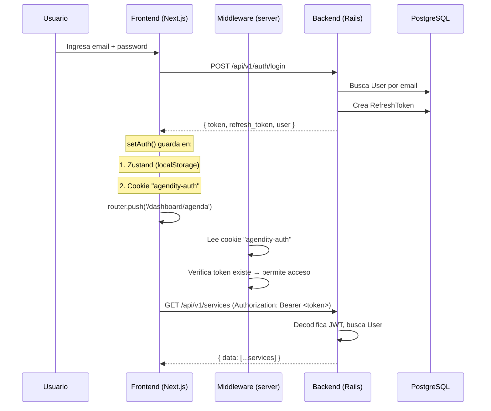
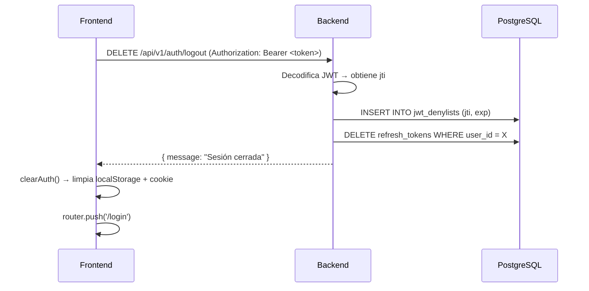

# Autenticación JWT — Agendity

> Última actualización: 2026-03-16

## Resumen

Agendity usa JWT (JSON Web Tokens) para autenticar la comunicación frontend ↔ API. El sistema incluye:
- Tokens de acceso (1 día de expiración)
- Refresh tokens (30 días, rotación por uso)
- Denylist para revocación de tokens (logout)
- Cookie sync para que el middleware de Next.js pueda proteger rutas

---

## Flujo completo



---

## Backend: Generación de tokens

### JWT Access Token

Generado por `Auth::TokenGenerator` (`app/services/auth/token_generator.rb`):

```ruby
# Payload del JWT
{
  sub: user.id,          # Subject: ID del usuario
  jti: SecureRandom.uuid, # JWT ID: único por token (para denylist)
  exp: 1.day.from_now.to_i # Expiración: 24 horas
}
```

**Secret key:** `Rails.application.credentials.devise_jwt_secret_key || ENV['DEVISE_JWT_SECRET_KEY']`

### Refresh Token

Almacenado en tabla `refresh_tokens`:

```ruby
# Modelo RefreshToken
token:      SecureRandom.hex(32)  # Token único de 64 chars
expires_at: 30.days.from_now       # 30 días de vida
user_id:    user.id                # FK al usuario
```

**Rotación:** Al usar un refresh token, se destruye el anterior y se crea uno nuevo.

---

## Backend: Autenticación de requests

Implementado en `Api::V1::BaseController#authenticate_user!`:

```ruby
def authenticate_user!
  token = request.headers["Authorization"]&.split(" ")&.last
  payload = Auth::TokenGenerator.decode(token) if token

  # Verificar token válido y no revocado
  if payload.nil? || JwtDenylist.exists?(jti: payload[:jti])
    render json: { error: "Not authenticated" }, status: :unauthorized
    return
  end

  @current_user = User.find_by(id: payload[:sub])
end
```

---

## Frontend: Almacenamiento dual (localStorage + Cookie)

### Por qué dual storage

| Storage | Quién lo lee | Para qué |
|---|---|---|
| **localStorage** (Zustand persist) | JavaScript del cliente | Axios interceptor, estado de la app |
| **Cookie** `agendity-auth` | Next.js middleware (servidor) | Protección de rutas antes del render |

### Implementación en auth-store.ts

```typescript
setAuth: (token, refreshToken, user) => {
  // 1. Guardar en Zustand (→ localStorage)
  set({ token, refreshToken, user });

  // 2. Sincronizar a cookie para middleware
  document.cookie = `agendity-auth=${encodeURIComponent(
    JSON.stringify({ state: { token, user } })
  )};path=/;max-age=${60 * 60 * 24 * 30};samesite=lax`;
},

clearAuth: () => {
  set({ token: null, refreshToken: null, user: null });
  // Borrar cookie
  document.cookie = 'agendity-auth=;path=/;max-age=0';
},
```

---

## Frontend: Middleware de protección de rutas

El middleware (`src/middleware.ts`) se ejecuta en el servidor antes de cada request:

```
Rutas públicas (sin auth):
  /, /login, /register, /explore, /[slug], /[slug]/ticket/*

Rutas protegidas (requieren auth):
  /dashboard/*

Lógica:
  1. ¿Es ruta pública? → Permitir
  2. ¿Tiene cookie con token? → No → Redirect a /login?redirect=<path>
  3. ¿Está en /dashboard y onboarding no completo? → Redirect a /dashboard/onboarding
  4. ¿Está en /dashboard/onboarding y ya completó? → Redirect a /dashboard/agenda
```

---

## Frontend: Axios interceptor (refresh automático)

En `lib/api/client.ts`:

```
1. Request interceptor: Agrega "Authorization: Bearer <token>" a cada request
2. Response interceptor:
   - Si recibe 401 y tiene refresh_token:
     a. Pausa requests pendientes
     b. POST /api/v1/auth/refresh con refresh_token
     c. Obtiene nuevo token + nuevo refresh_token
     d. Actualiza auth store
     e. Reintenta requests pausados con nuevo token
   - Si refresh falla: clearAuth() + redirect a /login
```

---

## Logout



---

## Endpoints de auth

```bash
# Login
curl -X POST http://localhost:3001/api/v1/auth/login \
  -H "Content-Type: application/json" \
  -d '{"email":"carlos@barberia-elite.com","password":"password123"}'

# Me (con token)
curl http://localhost:3001/api/v1/auth/me \
  -H "Authorization: Bearer eyJhbG..."

# Refresh
curl -X POST http://localhost:3001/api/v1/auth/refresh \
  -H "Content-Type: application/json" \
  -d '{"refresh_token":"abc123..."}'

# Logout
curl -X DELETE http://localhost:3001/api/v1/auth/logout \
  -H "Authorization: Bearer eyJhbG..."
```

---

## Seguridad

| Medida | Implementación |
|---|---|
| Token expiration | 24 horas (access), 30 días (refresh) |
| Token revocation | Denylist en BD (tabla jwt_denylists) |
| Refresh rotation | Token anterior se destruye al rotar |
| Rate limiting | Rack::Attack: 5 req/20s en login |
| CORS | Solo permite `localhost:3000` y `AGENDITY_WEB_URL` |
| Cookie flags | `samesite=lax`, `path=/` |
