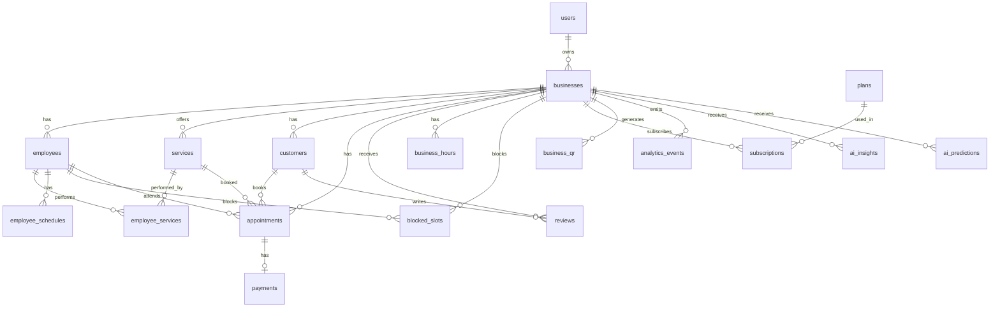

# Diseño de Base de Datos v1 (borrador)

> **Estado:** Borrador inicial — NO es el diseño final
> **Última actualización:** 2026-03-16

Este documento describe la primera iteración del esquema de base de datos de Agendity. Sirve como base de discusión para refinar antes de implementar.

> **Terminología:** En Agendity, **cliente** = el negocio (barbería/salón) que paga suscripción. **Usuario final** = la persona que reserva citas. En la BD, la tabla `customers` almacena usuarios finales (quienes reservan), no clientes de Agendity.

---

## Diagrama de relaciones (ERD)

---

## Tablas

### 1. users

Usuarios del sistema: dueños de negocio y superadmins.

| Campo | Tipo | Notas |
|---|---|---|
| id | bigint (PK) | |
| name | string | |
| email | string | unique, not null |
| password_hash | string | Devise encrypted |
| role | enum | `admin`, `business_owner` |
| created_at | datetime | |
| updated_at | datetime | |

---

### 2. businesses

Negocios registrados en la plataforma.

| Campo | Tipo | Notas |
|---|---|---|
| id | bigint (PK) | |
| owner_id | bigint (FK → users) | |
| name | string | not null |
| slug | string | unique, para URL pública (`agendity.com/barberia-elite`) |
| business_type | enum | `barberia`, `salon` |
| description | text | |
| phone | string | |
| email | string | |
| address | string | |
| city | string | |
| country | string | |
| latitude | decimal | para geolocalización / mapa |
| longitude | decimal | para geolocalización / mapa |
| logo_url | string | ActiveStorage attachment |
| cover_image_url | string | imagen de portada del negocio |
| instagram_url | string | |
| facebook_url | string | |
| rating_average | decimal | calculado desde reviews |
| total_reviews | integer | counter cache |
| timezone | string | ej: `America/Bogota` |
| currency | string | default: `COP`, para multi moneda futura |
| payment_instructions | text | instrucciones de pago que ve el usuario al reservar |
| bank_account_info | text | datos de cuenta para transferencias |
| cancellation_policy_pct | integer | porcentaje de penalización por no-show (30, 50, 100) |
| cancellation_deadline_hours | integer | horas antes de la cita para cancelar sin penalización |
| trial_ends_at | datetime | fecha de fin del período de prueba (30 días) |
| status | enum | `active`, `suspended`, `pending_approval` |
| onboarding_completed | boolean | default: false, true cuando completa el wizard |
| created_at | datetime | |
| updated_at | datetime | |

---

### 3. employees

Barberos, estilistas o profesionales del negocio.

| Campo | Tipo | Notas |
|---|---|---|
| id | bigint (PK) | |
| business_id | bigint (FK → businesses) | |
| name | string | not null |
| photo | string | ActiveStorage attachment |
| phone | string | |
| email | string | |
| active | boolean | default: true |
| created_at | datetime | |
| updated_at | datetime | |

---

### 4. services

Servicios ofrecidos por el negocio.

| Campo | Tipo | Notas |
|---|---|---|
| id | bigint (PK) | |
| business_id | bigint (FK → businesses) | |
| name | string | not null |
| description | text | |
| price | decimal | en moneda local |
| duration_minutes | integer | duración del servicio |
| active | boolean | default: true |
| created_at | datetime | |
| updated_at | datetime | |

---

### 5. employee_services

Relación many-to-many: qué servicios puede realizar cada empleado.

| Campo | Tipo | Notas |
|---|---|---|
| id | bigint (PK) | |
| employee_id | bigint (FK → employees) | |
| service_id | bigint (FK → services) | |

**Índice único:** `[employee_id, service_id]`

---

### 6. customers

Clientes del negocio. Se crean automáticamente al hacer una reserva.

| Campo | Tipo | Notas |
|---|---|---|
| id | bigint (PK) | |
| business_id | bigint (FK → businesses) | |
| name | string | |
| phone | string | |
| email | string | identificador principal para reconocer al cliente |
| created_at | datetime | |
| updated_at | datetime | |

**Índice único:** `[business_id, email]` — un cliente es único por negocio + email.

---

### 7. appointments

Citas agendadas.

| Campo | Tipo | Notas |
|---|---|---|
| id | bigint (PK) | |
| business_id | bigint (FK → businesses) | |
| employee_id | bigint (FK → employees) | |
| service_id | bigint (FK → services) | |
| customer_id | bigint (FK → customers) | |
| appointment_date | date | |
| start_time | time | |
| end_time | time | calculado: start_time + service.duration_minutes |
| price | decimal | precio al momento de la reserva |
| status | enum | ver estados abajo |
| ticket_code | string | unique, código del ticket de confirmación digital |
| ticket_url | string | URL de la imagen/PDF del ticket generado |
| checked_in_at | datetime | timestamp del check-in (escaneo QR al llegar) |
| created_at | datetime | |
| updated_at | datetime | |

**Estados:**
| Estado | Significado |
|---|---|
| `pending_payment` | Reservada, esperando pago |
| `payment_sent` | Cliente subió comprobante |
| `confirmed` | Negocio confirmó el pago → se genera ticket digital |
| `checked_in` | Cliente llegó y escanearon su QR |
| `cancelled` | Cancelada |
| `completed` | Servicio realizado |

---

### 8. payments

Pagos P2P (comprobante de pago del cliente).

| Campo | Tipo | Notas |
|---|---|---|
| id | bigint (PK) | |
| appointment_id | bigint (FK → appointments) | |
| payment_method | enum | `cash`, `transfer` |
| amount | decimal | |
| proof_image_url | string | ActiveStorage attachment |
| status | enum | ver estados abajo |
| created_at | datetime | |
| updated_at | datetime | |

**Estados:**
| Estado | Significado |
|---|---|
| `pending` | Esperando comprobante |
| `submitted` | Comprobante enviado |
| `approved` | Pago confirmado por el negocio |
| `rejected` | Comprobante rechazado |

---

### 9. reviews

Reseñas de usuarios sobre negocios.

| Campo | Tipo | Notas |
|---|---|---|
| id | bigint (PK) | |
| business_id | bigint (FK → businesses) | |
| customer_id | bigint (FK → customers) | nullable, vincula si el usuario ya existe |
| customer_name | string | nombre mostrado (respaldo si no hay customer_id) |
| rating | integer | 1 a 5 |
| comment | text | |
| created_at | datetime | |

---

### 10. business_hours

Horarios de operación del negocio.

| Campo | Tipo | Notas |
|---|---|---|
| id | bigint (PK) | |
| business_id | bigint (FK → businesses) | |
| day_of_week | integer | 0=domingo, 1=lunes ... 6=sábado |
| open_time | time | |
| close_time | time | |

---

### 11. employee_schedules

Horarios específicos de cada empleado.

| Campo | Tipo | Notas |
|---|---|---|
| id | bigint (PK) | |
| employee_id | bigint (FK → employees) | |
| day_of_week | integer | 0=domingo ... 6=sábado |
| start_time | time | |
| end_time | time | |

---

### 11b. blocked_slots *(sugerido)*

Bloqueos manuales en la agenda (almuerzo, día libre, vacaciones, etc.).

| Campo | Tipo | Notas |
|---|---|---|
| id | bigint (PK) | |
| business_id | bigint (FK → businesses) | |
| employee_id | bigint (FK → employees) | nullable (null = bloqueo del negocio completo) |
| date | date | |
| start_time | time | |
| end_time | time | |
| reason | string | opcional: "Almuerzo", "Vacaciones", etc. |
| created_at | datetime | |

---

### 12. subscriptions

Suscripciones activas de cada negocio.

| Campo | Tipo | Notas |
|---|---|---|
| id | bigint (PK) | |
| business_id | bigint (FK → businesses) | |
| plan_id | bigint (FK → plans) | |
| start_date | date | |
| end_date | date | |
| status | enum | `active`, `expired`, `cancelled` |
| created_at | datetime | |
| updated_at | datetime | |

---

### 13. plans

Planes de suscripción de la plataforma. Gestionados por el superusuario.

| Campo | Tipo | Notas |
|---|---|---|
| id | bigint (PK) | |
| name | string | Básico, Profesional, Inteligente |
| price_monthly | decimal | en moneda local (COP) |
| max_employees | integer | límite de empleados (null = ilimitado) |
| max_services | integer | límite de servicios (null = ilimitado) |
| max_reservations_month | integer | reservas por mes (null = ilimitado) |
| max_customers | integer | clientes en BD (null = ilimitado) |
| ai_features | boolean | acceso a features de IA |
| ticket_digital | boolean | acceso al ticket VIP digital |
| advanced_reports | boolean | reportes avanzados |
| brand_customization | boolean | personalización logo/colores |
| featured_listing | boolean | destacado en mapa/listado |
| priority_support | boolean | soporte prioritario |
| created_at | datetime | |
| updated_at | datetime | |

---

### 14. discount_codes

Códigos promocionales para suscripciones.

| Campo | Tipo | Notas |
|---|---|---|
| id | bigint (PK) | |
| code | string | unique, not null |
| discount_percentage | integer | 1–100 |
| expires_at | datetime | |
| max_uses | integer | |
| current_uses | integer | default: 0 |
| created_at | datetime | |

---

### 15. business_qr

Códigos QR generados por negocio.

| Campo | Tipo | Notas |
|---|---|---|
| id | bigint (PK) | |
| business_id | bigint (FK → businesses) | |
| qr_url | string | URL de la imagen del QR |
| created_at | datetime | |

---

### 16. analytics_events

Eventos del sistema para alimentar la IA y reportes.

| Campo | Tipo | Notas |
|---|---|---|
| id | bigint (PK) | |
| business_id | bigint (FK → businesses) | |
| event_type | string | tipo de evento |
| metadata_json | jsonb | datos adicionales del evento |
| created_at | datetime | |

**Tipos de evento:**
- `appointment_created`
- `appointment_cancelled`
- `appointment_completed`
- `customer_returned`
- `payment_approved`
- `review_created`

---

## Tablas de IA (fase futura)

### 17. ai_insights

Recomendaciones generadas por IA para cada negocio.

| Campo | Tipo | Notas |
|---|---|---|
| id | bigint (PK) | |
| business_id | bigint (FK → businesses) | |
| type | string | tipo de insight |
| message | text | recomendación legible |
| created_at | datetime | |

**Tipos:** `low_demand_hour`, `returning_customers`, `price_suggestion`, `inactive_customer`

---

### 18. ai_predictions

Proyecciones calculadas por IA.

| Campo | Tipo | Notas |
|---|---|---|
| id | bigint (PK) | |
| business_id | bigint (FK → businesses) | |
| prediction_type | string | |
| predicted_value | decimal | |
| created_at | datetime | |

**Tipos:** `monthly_revenue`, `customer_return_rate`, `demand_forecast`

---

## Geolocalización / Mapa

Cubierto con `businesses.latitude` y `businesses.longitude`.

Permite:
- Mostrar negocios cercanos al cliente
- Búsqueda geográfica con Geocoder
- Índice espacial en PostgreSQL para queries eficientes

---

## Superusuario

Definido en `users.role = 'admin'`.

Acceso vía ActiveAdmin a:
- Gestión de planes y precios
- Ver/aprobar/suspender negocios
- Códigos de descuento
- Métricas globales

---

## Notas sobre escalabilidad

Este esquema soporta:
- Miles de negocios con multi-tenancy por `business_id`
- Millones de citas (indexar por `business_id`, `appointment_date`, `status`)
- IA basada en `analytics_events` como fuente de datos
- Pasarela de pago futura (extender tabla `payments`)
- Multi país (campo `country` en businesses)
- Multi moneda (agregar campo `currency` a businesses y plans)

---

## Visión de datos

> Agendity no es solo una agenda. Es una base de datos del comportamiento de miles de negocios de servicios. Los `analytics_events`, las citas, los patrones de clientes — eso es lo que realmente tiene valor a escala.
