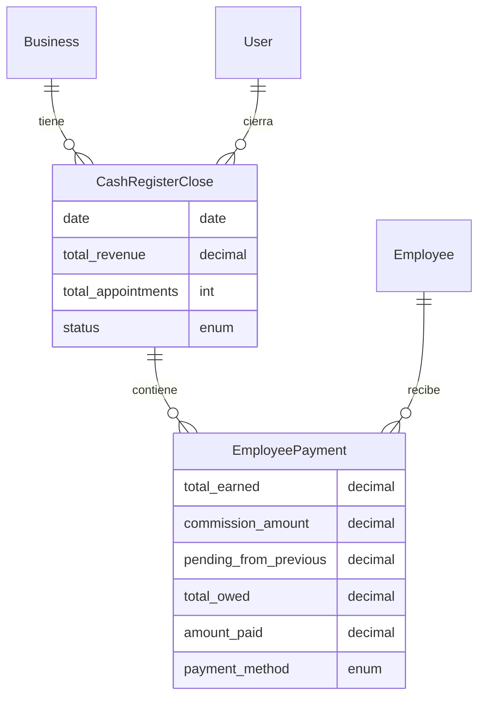
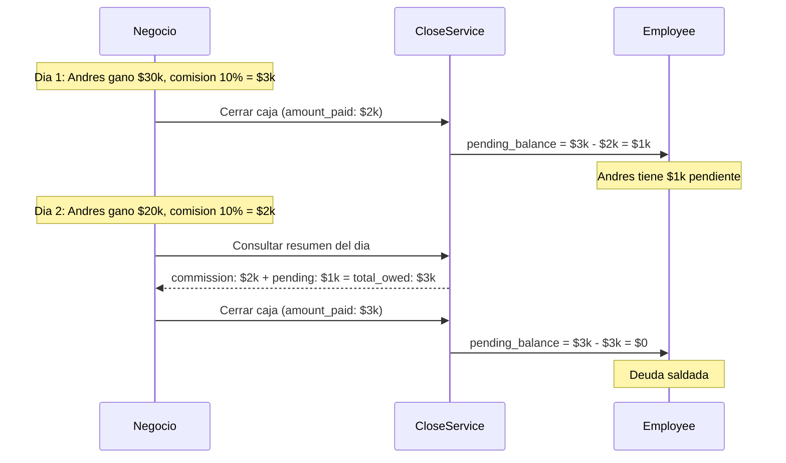

# Sistema de Cierre de Caja — Agendity

> Ultima actualizacion: 2026-03-22
> Disponible desde: **Plan Profesional+**

## Resumen

El cierre de caja permite al negocio cerrar contablemente el dia: ver ingresos, calcular comisiones por empleado, registrar pagos y generar un historial de cierres. Si se paga menos de lo owed a un empleado, la deuda se arrastra al siguiente cierre.

---

## Modelos de datos

### CashRegisterClose

```sql
CREATE TABLE cash_register_closes (
  id bigint PRIMARY KEY,
  business_id bigint NOT NULL REFERENCES businesses(id),
  closed_by_user_id bigint NOT NULL REFERENCES users(id),
  date date NOT NULL,
  closed_at timestamp,
  total_revenue decimal(12,2) DEFAULT 0,
  total_tips decimal(12,2) DEFAULT 0,
  total_appointments integer DEFAULT 0,
  notes text,
  status integer DEFAULT 0,  -- 0=draft, 1=closed
  timestamps
);
-- Unique: un cierre por dia por negocio
CREATE UNIQUE INDEX idx_cash_register_business_date ON cash_register_closes(business_id, date);
```

### EmployeePayment

```sql
CREATE TABLE employee_payments (
  id bigint PRIMARY KEY,
  cash_register_close_id bigint NOT NULL REFERENCES cash_register_closes(id),
  employee_id bigint NOT NULL REFERENCES employees(id),
  appointments_count integer DEFAULT 0,
  total_earned decimal(12,2) DEFAULT 0,       -- ingresos generados por el empleado
  commission_pct decimal(5,2) DEFAULT 0,       -- % de comision al momento del cierre
  commission_amount decimal(12,2) DEFAULT 0,   -- comision calculada
  pending_from_previous decimal(12,2) DEFAULT 0, -- deuda arrastrada del cierre anterior
  total_owed decimal(12,2) DEFAULT 0,          -- commission_amount + pending_from_previous
  amount_paid decimal(12,2) DEFAULT 0,         -- cuanto se le pago realmente
  payment_method integer DEFAULT 0,            -- 0=cash, 1=transfer
  notes text,
  timestamps
);
-- ActiveStorage: has_one_attached :proof (comprobante de transferencia)
```

### Employee (campos relacionados)

```sql
-- En tabla employees:
commission_percentage decimal(5,2)  -- % de comision (0 = sin comision)
pending_balance decimal(12,2) DEFAULT 0  -- deuda acumulada pendiente de pago
```

### Relaciones



---

## Flujo de deuda acumulada



---

## API Endpoints

Todos requieren autenticacion JWT + Plan Profesional+.

### GET /api/v1/cash_register/today

Resumen del dia para cierre de caja.

```bash
curl -H "Authorization: Bearer $TOKEN" \
  "http://localhost:3001/api/v1/cash_register/today?date=2026-03-22"
```

**Respuesta:**
```json
{
  "data": {
    "date": "2026-03-22",
    "total_revenue": 55000.0,
    "total_appointments": 2,
    "already_closed": false,
    "close_id": null,
    "employees": [
      {
        "employee_id": 1,
        "employee_name": "Andres Lopez",
        "appointments_count": 1,
        "total_earned": 30000.0,
        "commission_pct": 10.0,
        "commission_amount": 3000.0,
        "pending_from_previous": 0.0,
        "total_owed": 3000.0,
        "appointments": [
          {
            "id": 42,
            "customer_name": "Pedro Martinez",
            "service_name": "Corte degradado (fade)",
            "start_time": "11:00",
            "price": 30000.0,
            "status": "completed"
          }
        ]
      }
    ]
  }
}
```

### POST /api/v1/cash_register/close

Cierra la caja del dia. No se puede cerrar dos veces ni cerrar dias futuros.

```bash
curl -X POST -H "Authorization: Bearer $TOKEN" \
  -H "Content-Type: application/json" \
  -d '{
    "date": "2026-03-22",
    "notes": "Todo bien hoy",
    "employee_payments": [
      {
        "employee_id": 1,
        "appointments_count": 1,
        "total_earned": 30000,
        "commission_pct": 10,
        "commission_amount": 3000,
        "amount_paid": 2000,
        "payment_method": "cash"
      }
    ]
  }' \
  "http://localhost:3001/api/v1/cash_register/close"
```

**Logica del CloseService:**
1. Valida que la fecha no sea futura
2. Valida que no exista cierre previo (status: closed)
3. Calcula total_revenue y total_appointments de citas checked_in/completed
4. Para cada empleado:
   - Lee `pending_balance` actual del empleado
   - Calcula `total_owed = commission_amount + pending_balance`
   - Registra `amount_paid` (lo que realmente se pago)
   - Actualiza `employee.pending_balance = max(total_owed - amount_paid, 0)`
5. Crea ActivityLog

### GET /api/v1/cash_register/history

```bash
curl -H "Authorization: Bearer $TOKEN" \
  "http://localhost:3001/api/v1/cash_register/history?from=2026-03-01&to=2026-03-31"
```

### GET /api/v1/cash_register/:id

Detalle de un cierre con pagos a empleados.

### POST /api/v1/cash_register/upload_proof

Sube comprobante de transferencia para un pago a empleado.

```bash
curl -X POST -H "Authorization: Bearer $TOKEN" \
  -F "employee_payment_id=1" \
  -F "proof=@comprobante.jpg" \
  "http://localhost:3001/api/v1/cash_register/upload_proof"
```

### DELETE /api/v1/cash_register/delete_proof

Elimina comprobante de un pago.

```bash
curl -X DELETE -H "Authorization: Bearer $TOKEN" \
  "http://localhost:3001/api/v1/cash_register/delete_proof?employee_payment_id=1"
```

---

## Frontend

### Paginas

| Ruta | Descripcion |
|---|---|
| `/dashboard/cash-register` | Resumen del dia con desglose por empleado, pagos y cierre |
| `/dashboard/cash-register/history` | Historial de cierres con filtros y detalle |

### UX de pagos por empleado

**Empleado con comision:**
- Boton "Confirmar pago de $X" (monto fijo = comision + pendiente anterior)
- Link "Editar monto" revela input editable
- Si paga menos → modal de advertencia: "La diferencia se sumara como pendiente en el proximo cierre"
- Metodo: efectivo (confirmar) o transferencia (subir comprobante)

**Empleado sin comision:**
- Input libre para ingresar monto del pago del dia
- Mismo flujo de efectivo/transferencia

**Resumen del dia:**
- Ingresos del dia - Total pagos empleados = Ganancia neta
- Se actualiza en vivo conforme se confirman pagos

### Restriccion de plan

- Sidebar: icono de lock si plan < Profesional
- Pagina: muestra `UpgradeBanner` si no tiene acceso
- Backend: `require_professional_plan!` valida `has_feature?(:advanced_reports)`

---

## Servicios

| Servicio | Responsabilidad |
|---|---|
| `CashRegister::DailySummaryService` | Calcula resumen del dia: ingresos, citas, desglose por empleado con citas individuales |
| `CashRegister::CloseService` | Cierra caja: registra pagos, calcula deudas, actualiza pending_balance |
