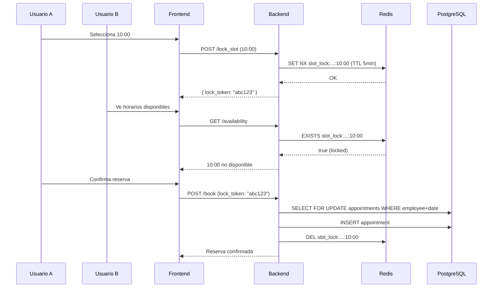

# Protección de Slots Concurrentes — Agendity

> Última actualización: 2026-03-16

## Problema

Cuando dos usuarios intentan reservar el mismo horario simultáneamente, se puede producir double-booking.

## Solución: 3 capas de protección



### Capa 1: Redis Slot Lock (preventiva)

**Archivo:** `app/services/bookings/slot_lock_service.rb`

Cuando un usuario selecciona un horario en el step 3 del booking, el frontend puede llamar `POST /:slug/lock_slot` para bloquearlo temporalmente por **5 minutos** mientras completa el formulario.

```ruby
# Lock: SET NX con TTL de 5 minutos
Bookings::SlotLockService.lock(
  business_id: 1,
  employee_id: 3,
  date: "2026-03-17",
  time: "10:00"
)
# => "abc123..." (lock_token) o nil si ya está bloqueado
```

El AvailabilityService verifica locks antes de mostrar slots como disponibles.

**Endpoints:**
```bash
# Bloquear slot
curl -X POST http://localhost:3001/api/v1/public/barberia-elite/lock_slot \
  -H "Content-Type: application/json" \
  -d '{"employee_id": 1, "date": "2026-03-17", "time": "10:00"}'

# Liberar slot
curl -X POST http://localhost:3001/api/v1/public/barberia-elite/unlock_slot \
  -H "Content-Type: application/json" \
  -d '{"employee_id": 1, "date": "2026-03-17", "time": "10:00", "lock_token": "abc123"}'

# Verificar disponibilidad antes de confirmar
curl "http://localhost:3001/api/v1/public/barberia-elite/check_slot?employee_id=1&date=2026-03-17&time=10:00"
```

### Capa 2: SELECT FOR UPDATE (transaccional)

**Archivo:** `app/services/appointments/create_appointment_service.rb`

Al crear la cita, se ejecuta dentro de una transacción con lock de fila:

```ruby
ActiveRecord::Base.transaction do
  # Lock: bloquea TODAS las citas del empleado en esa fecha
  @business.appointments
    .where(employee_id: employee.id, appointment_date: date)
    .lock("FOR UPDATE")
    .load

  # Verificar disponibilidad (seguro, filas bloqueadas)
  if overlapping_appointment?(...)
    return failure("Este horario ya no está disponible")
  end

  # Insertar (ningún otro proceso puede interferir)
  @business.appointments.create!(...)
end
```

### Capa 3: Unique Index (último recurso)

**Migración:** `20260316214159_add_unique_slot_index_to_appointments.rb`

Índice parcial único en PostgreSQL:

```sql
CREATE UNIQUE INDEX idx_appointments_unique_slot
  ON appointments (employee_id, appointment_date, start_time)
  WHERE status != 4;  -- excluye canceladas
```

Si por alguna razón las capas 1 y 2 fallan, PostgreSQL rechaza el duplicado y el service retorna:
> "Este horario acaba de ser reservado por otra persona. Selecciona otro horario."

## Efectividad combinada

| Capa | Protege contra | Efectividad |
|---|---|---|
| Redis lock | Dos usuarios en el formulario al mismo tiempo | ~99.9% |
| SELECT FOR UPDATE | Race condition entre SELECT y INSERT | ~99.99% |
| Unique index | Cualquier edge case restante | 100% (DB constraint) |
