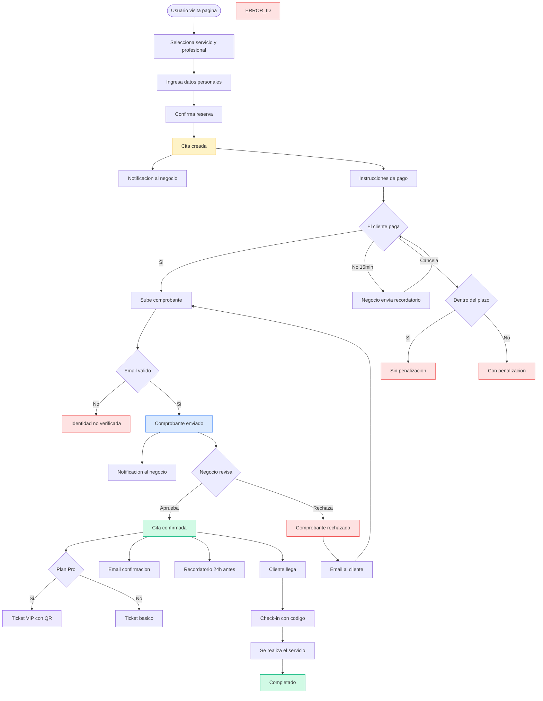
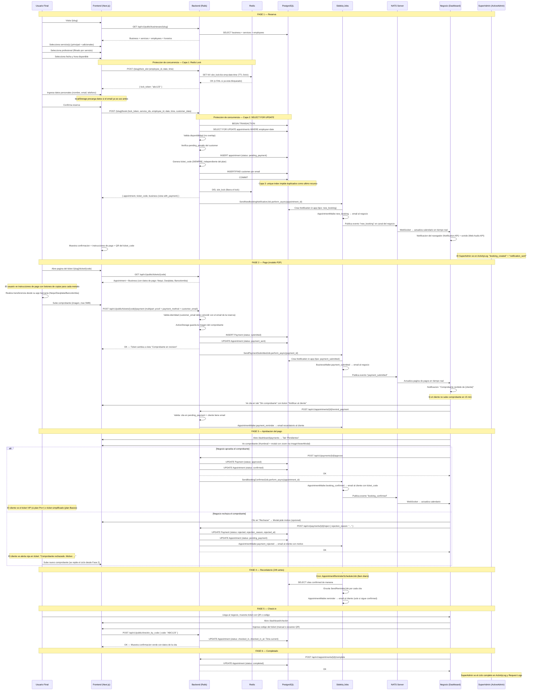
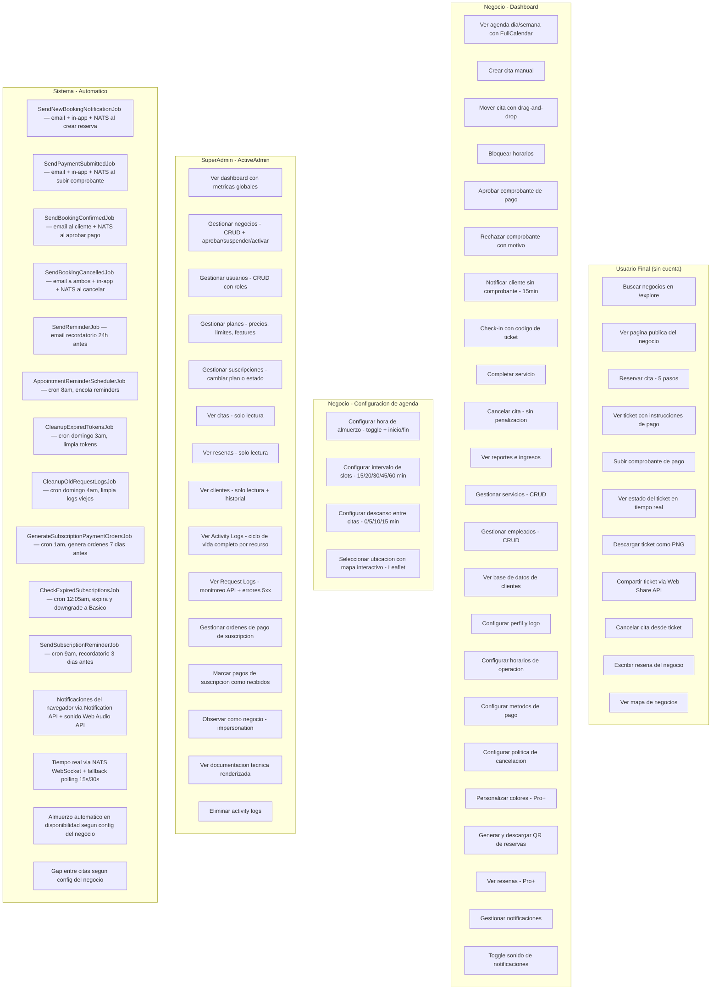
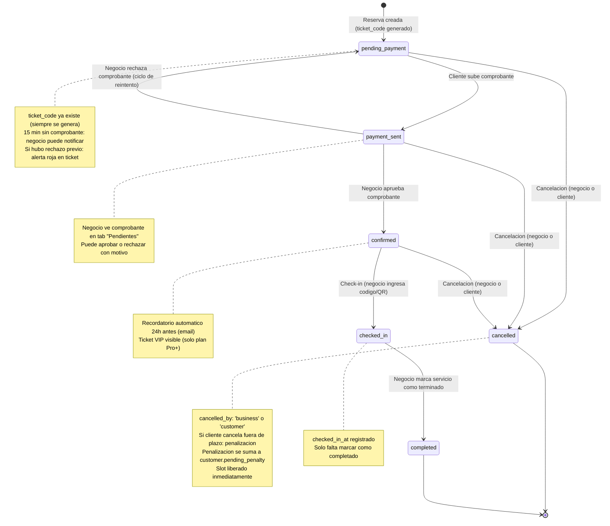
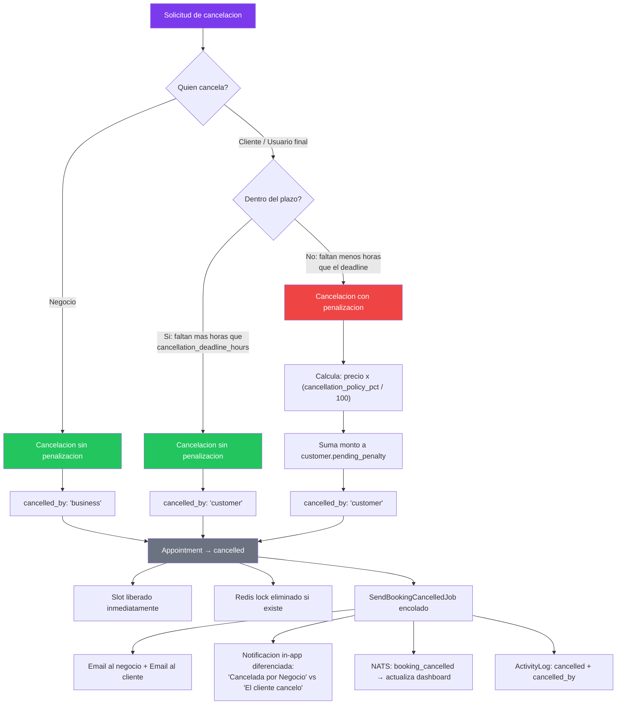
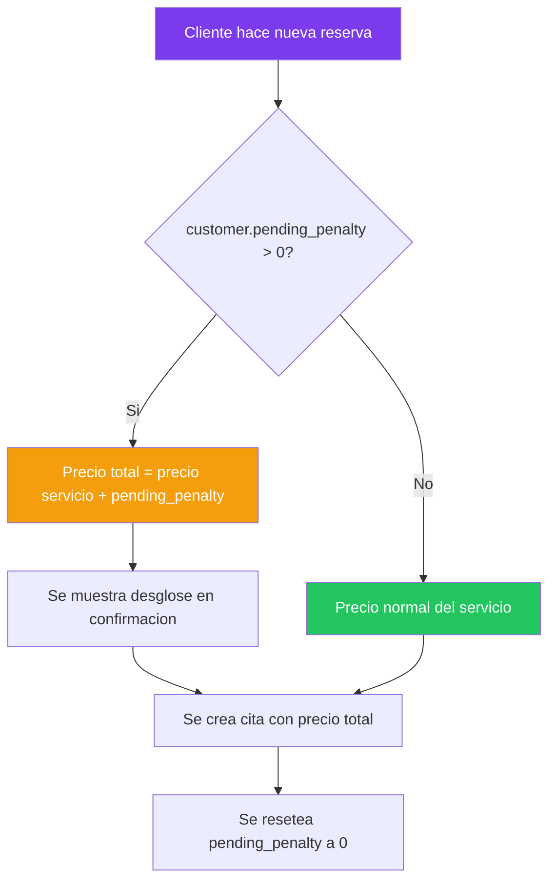
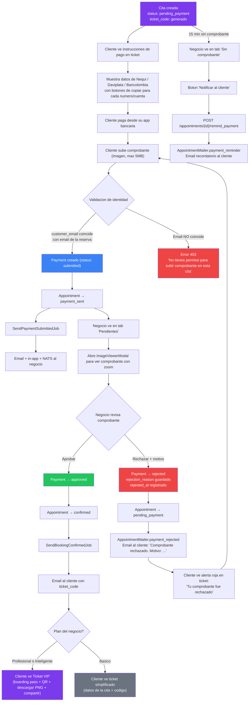

# Flujos Completos — Agendify

> Ultima actualizacion: 2026-03-16
> **Fase del proyecto:** Pre-lanzamiento

Este documento contiene diagramas Mermaid detallados de todos los flujos del sistema Agendify, incluyendo todos los actores, estados, jobs en background, y comunicacion en tiempo real.

---

## Tabla de contenido

1. [Diagrama 1: Ciclo de vida completo de una reserva (end-to-end)](#diagrama-1-ciclo-de-vida-completo-de-una-reserva)
2. [Diagrama 2: Mapa de acciones por actor](#diagrama-2-mapa-de-acciones-por-actor)
3. [Diagrama 3: Maquina de estados de una cita (Appointment)](#diagrama-3-maquina-de-estados-de-una-cita)
4. [Diagrama 4: Flujo de cancelacion](#diagrama-4-flujo-de-cancelacion)
5. [Diagrama 5: Flujo de pagos con ciclo de rechazo](#diagrama-5-flujo-de-pagos-con-ciclo-de-rechazo)
6. [Notas tecnicas importantes](#notas-tecnicas-importantes)

---

## Diagrama 1: Ciclo de vida completo de una reserva

### 1A. Versión simplificada (Flowchart)

Flujo visual del ciclo de vida de una reserva con decisiones y actores.

### 1B. Versión detallada (Sequence Diagram)

Diagrama de secuencia que muestra CADA paso desde que un usuario final visita la pagina del negocio hasta el check-in y completado del servicio. Incluye todos los actores del sistema.

---

## Diagrama 2: Mapa de acciones por actor

Diagrama que muestra lo que cada actor puede hacer en el sistema.

---

## Diagrama 3: Maquina de estados de una cita

Diagrama de estados que muestra todas las transiciones posibles de una cita (`Appointment`).

### Tabla resumen de estados

| Estado | Valor enum | Significado | Quien lo cambia |
|---|---|---|---|
| `pending_payment` | 0 | Reservada, esperando pago | Sistema (al crear cita) |
| `payment_sent` | 1 | Comprobante subido, en revision | Usuario final |
| `confirmed` | 2 | Pago aprobado, cita confirmada | Negocio (dashboard) |
| `checked_in` | 3 | Cliente llego, QR escaneado | Negocio (checkin) |
| `cancelled` | 4 | Cita cancelada | Negocio o usuario |
| `completed` | 5 | Servicio realizado | Negocio |

### Tabla resumen de estados del pago (Payment)

| Estado | Significado |
|---|---|
| `submitted` | Comprobante subido, esperando revision |
| `approved` | Negocio confirmo el pago |
| `rejected` | Comprobante rechazado (con motivo opcional) |

---

## Diagrama 4: Flujo de cancelacion

Diagrama que muestra la logica de cancelacion diferenciada por actor, con calculo de penalizacion.

### Cobro de penalizacion en proxima reserva

### Casos especiales de cancelacion

- Si `cancellation_policy_pct` es `0`: nunca se genera penalizacion (politica desactivada)
- Si la cita esta en `pending_payment` (no pagada): no se aplica penalizacion
- Las penalizaciones se **acumulan**: si el usuario cancela dos citas tarde, ambas se suman en `pending_penalty`
- Cada negocio configura su politica desde Settings > Cancelacion

---

## Diagrama 5: Flujo de pagos con ciclo de rechazo

Diagrama detallado del flujo de pagos P2P, incluyendo el ciclo completo de rechazo y reintento.

### Emails del sistema de pagos

| Email | Mailer method | Destinatario | Cuando se envia |
|---|---|---|---|
| Recordatorio de pago | `AppointmentMailer#payment_reminder` | Cliente | Negocio hace clic en "Notificar" (despues de 15 min) |
| Comprobante rechazado | `AppointmentMailer#payment_rejected` | Cliente | Negocio rechaza un comprobante (incluye motivo) |
| Cita confirmada | `AppointmentMailer#booking_confirmed` | Cliente | Negocio aprueba el pago |
| Comprobante recibido | `BusinessMailer#payment_submitted` | Negocio | Cliente sube comprobante |

---

## Notas tecnicas importantes

### ticket_code: siempre se genera

El `ticket_code` se genera **al momento de crear la cita** (`CreateAppointmentService`), no al aprobar el pago. Esto es independiente del plan del negocio. El codigo permite:
- Identificar la cita en el tab "Sin comprobante" del dashboard de pagos
- Que el negocio busque pagos por codigo de ticket
- Check-in por codigo (el negocio ingresa el codigo)
- URLs del ticket: `/{slug}/ticket/{code}`

Lo que es **exclusivo del plan Profesional+** es la visualizacion VIP del ticket: diseno boarding pass, QR visible, descarga como PNG, compartir via Web Share API.

### Background jobs: Sidekiq + Redis

Todos los jobs se procesan con Sidekiq (colas: `default` y `low`). Cada job que afecta la UI del dashboard publica un evento en NATS para actualizar en tiempo real.

### Tiempo real: NATS + fallback polling

- **Canal primario:** NATS WebSocket (actualizacion instantanea del calendario y pagos)
- **Fallback:** Polling automatico (calendario cada 15s, notificaciones cada 30s)
- Las notificaciones del navegador usan la Notification API nativa + sonido configurable con Web Audio API

### Datos de pago: encriptados

Los datos de pago del negocio (`nequi_phone`, `daviplata_phone`, `bancolombia_account`) estan encriptados en la base de datos con `Rails.encrypts` y filtrados en logs.

### Proteccion de concurrencia: 3 capas

| Capa | Mecanismo | Protege contra | Efectividad |
|---|---|---|---|
| 1 | Redis SETNX (lock 5min) | Dos usuarios en el formulario al mismo tiempo | ~99.9% |
| 2 | SELECT FOR UPDATE (transaccion) | Race condition entre SELECT e INSERT | ~99.99% |
| 3 | Unique index parcial (PostgreSQL) | Cualquier edge case restante | 100% |

### Penalizaciones por cancelacion

Las penalizaciones se rastrean en `customer.pending_penalty` y se cobran automaticamente en la siguiente reserva del cliente. Cada negocio configura:
- `cancellation_policy_pct`: 0%, 30%, 50%, 100%
- `cancellation_deadline_hours`: horas minimas antes de la cita para cancelar sin penalizacion

### SuperAdmin: visibilidad completa

El SuperAdmin (ActiveAdmin) tiene acceso a:
- **Activity Logs:** auditoria de todas las acciones del sistema (booking_created, payment_approved, business_suspended, etc.)
- **Request Logs:** registro de todas las peticiones HTTP a la API (metodo, path, status, duracion, IP)
- **Ordenes de pago de suscripcion:** gestion manual de pagos de suscripcion de negocios (modelo P2P)
- **Dashboard de metricas:** totales de negocios, usuarios, citas, ingresos
