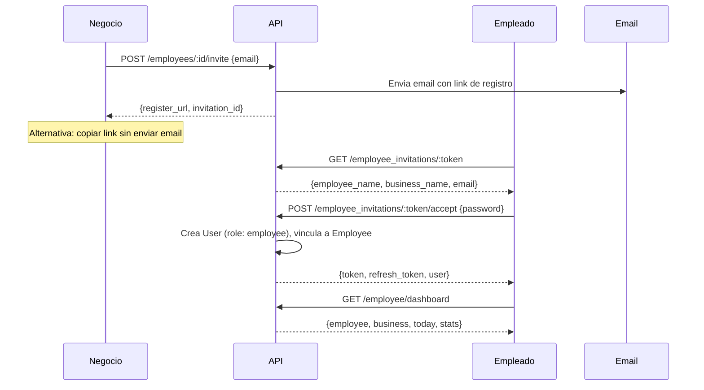
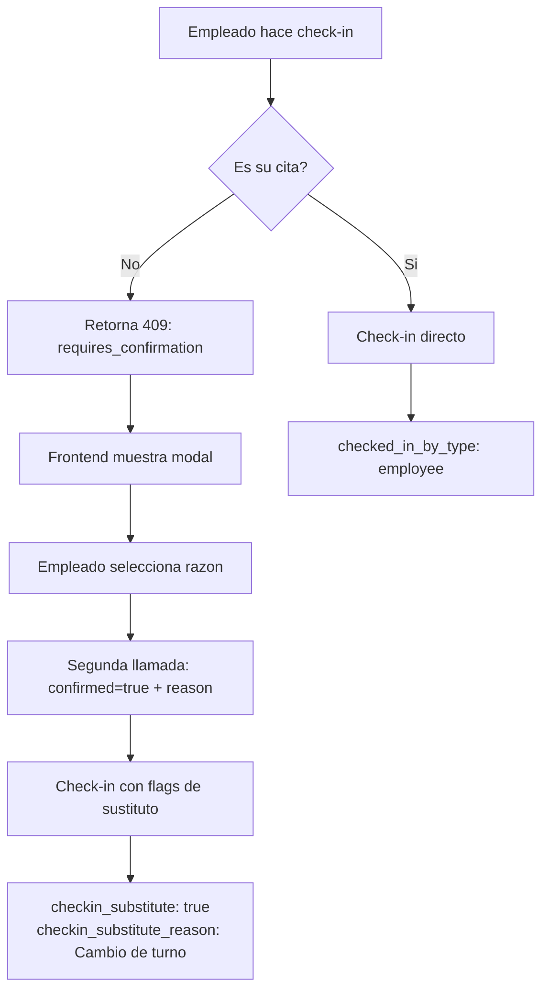

# Portal del Empleado — Agendity

> Ultima actualizacion: 2026-03-22

## Resumen

Los empleados pueden tener su propia cuenta en Agendity para acceder a un portal independiente donde ven sus citas, hacen check-in y consultan su desempeno. El flujo comienza con una invitacion del negocio.

---

## Flujo completo



---

## Modelo de datos

### EmployeeInvitation

```sql
CREATE TABLE employee_invitations (
  id bigint PRIMARY KEY,
  employee_id bigint NOT NULL REFERENCES employees(id),
  business_id bigint NOT NULL REFERENCES businesses(id),
  email varchar NOT NULL,
  token varchar NOT NULL,           -- urlsafe_base64(32), unique
  accepted_at timestamp,            -- null = pendiente
  expires_at timestamp NOT NULL,    -- 72 horas desde creacion
  timestamps
);
CREATE UNIQUE INDEX ON employee_invitations(token);
```

### Campos en Employee

```sql
user_id bigint REFERENCES users(id)  -- null = sin cuenta, present = vinculado
```

### Campos de check-in en Appointment

```sql
checked_in_by_type varchar   -- "business" | "employee"
checked_in_by_id integer     -- user_id de quien hizo check-in
checkin_substitute boolean DEFAULT false
checkin_substitute_reason varchar  -- razon si fue sustituto
```

---

## API Endpoints

### Invitacion (desde el negocio, requiere auth)

#### POST /api/v1/employees/:id/invite

Genera invitacion y opcionalmente envia email.

```bash
# Enviar por email
curl -X POST -H "Authorization: Bearer $TOKEN" \
  -H "Content-Type: application/json" \
  -d '{"email": "andres@email.com"}' \
  "http://localhost:3001/api/v1/employees/1/invite"

# Solo generar link (sin email)
curl -X POST -H "Authorization: Bearer $TOKEN" \
  -H "Content-Type: application/json" \
  -d '{"email": "andres@email.com", "send_email": false}' \
  "http://localhost:3001/api/v1/employees/1/invite"
```

**Respuesta:**
```json
{
  "data": {
    "message": "Invitacion enviada",
    "invitation_id": 1,
    "register_url": "https://agendity.co/employee/register?token=abc123..."
  }
}
```

### Invitacion (publica, sin auth)

#### GET /api/v1/employee_invitations/:token

Muestra datos de la invitacion para la pagina de registro.

```bash
curl "http://localhost:3001/api/v1/employee_invitations/abc123"
```

**Respuesta:**
```json
{
  "data": {
    "employee_name": "Andres Lopez",
    "business_name": "Barberia Elite",
    "email": "andres@email.com",
    "expired": false,
    "accepted": false
  }
}
```

#### POST /api/v1/employee_invitations/:token/accept

Crea cuenta de usuario y vincula al empleado. Retorna JWT para auto-login.

```bash
curl -X POST -H "Content-Type: application/json" \
  -d '{"password": "12345678", "password_confirmation": "12345678"}' \
  "http://localhost:3001/api/v1/employee_invitations/abc123/accept"
```

**Respuesta:**
```json
{
  "data": {
    "token": "eyJhb...",
    "refresh_token": "a1b2c3...",
    "user": { "id": 5, "name": "Andres Lopez", "role": "employee", ... }
  }
}
```

### Portal del empleado (requiere auth + role employee)

#### GET /api/v1/employee/dashboard

```bash
curl -H "Authorization: Bearer $EMPLOYEE_TOKEN" \
  "http://localhost:3001/api/v1/employee/dashboard"
```

**Respuesta:**
```json
{
  "data": {
    "employee": { "id": 1, "name": "Andres Lopez", "score": 75, "rating_avg": 4.2, ... },
    "business": { "name": "Barberia Elite", "logo_url": "..." },
    "today": [ ... appointments ... ],
    "stats": {
      "today_count": 3,
      "month_completed": 45,
      "month_revenue": 1350000
    }
  }
}
```

#### GET /api/v1/employee/score

```bash
curl -H "Authorization: Bearer $EMPLOYEE_TOKEN" \
  "http://localhost:3001/api/v1/employee/score"
```

**Respuesta:**
```json
{
  "data": {
    "overall": 75,
    "rating_avg": 4.2,
    "on_time_rate": 85.0,
    "completed_appointments": 120,
    "total_revenue": 3600000
  }
}
```

#### GET /api/v1/employee/appointments

```bash
curl -H "Authorization: Bearer $EMPLOYEE_TOKEN" \
  "http://localhost:3001/api/v1/employee/appointments?date=2026-03-22"
```

#### POST /api/v1/employee/appointments/:id/checkin

Check-in desde el empleado. Si la cita no es suya, requiere confirmacion.

```bash
# Check-in normal (su propia cita)
curl -X POST -H "Authorization: Bearer $EMPLOYEE_TOKEN" \
  "http://localhost:3001/api/v1/employee/appointments/42/checkin"

# Si es cita de otro empleado, primera llamada retorna 409:
# {"error": "...", "requires_confirmation": true, "assigned_employee": "Carlos"}

# Confirmar sustituto
curl -X POST -H "Authorization: Bearer $EMPLOYEE_TOKEN" \
  -H "Content-Type: application/json" \
  -d '{"confirmed": true, "substitute_reason": "Cambio de turno"}' \
  "http://localhost:3001/api/v1/employee/appointments/42/checkin"
```

---

## Score del empleado

### Formula

```
Score = Calificacion clientes (60%) + Puntualidad (40%)
```

**Solo factores que el empleado controla.** La tasa de citas completadas fue excluida porque las cancelaciones del cliente penalizarian injustamente al empleado.

| Factor | Peso | Calculo |
|---|---|---|
| Calificacion | 60% | Promedio de reviews (0-5) normalizado a 0-100 |
| Puntualidad | 40% | % de check-ins donde `checked_in_at <= start_time + 5min` |

Si no hay datos (empleado nuevo), ambos factores usan 50 como default.

### Donde se muestra

| Lugar | Que ve |
|---|---|
| Portal del empleado | Score, calificacion, puntualidad, citas completadas, ingresos |
| Lista de empleados del negocio | Score y rating_avg (campos en EmployeeSerializer) |

---

## Check-in avanzado

### Flujo de sustituto



### Razones predeterminadas

- Cambio de turno
- Empleado ausente
- Reasignacion
- Solicitud del cliente
- Otro (campo libre)

---

## QR Scanner

Componente reutilizable `QrScanner` (`components/shared/qr-scanner.tsx`) usado tanto en el check-in del negocio como del empleado.

- Libreria: `html5-qrcode`
- Camara trasera en movil (`facingMode: environment`)
- Funciona en PC y movil desde el browser
- Modal oscuro con video de camara
- Al escanear exitosamente, ejecuta el check-in automaticamente

---

## Frontend

### Rutas del empleado

| Ruta | Pagina |
|---|---|
| `/employee` | Dashboard: score, calificacion, stats, citas de hoy |
| `/employee/appointments` | Lista de citas con filtro por fecha y badges de color por status |
| `/employee/checkin` | Escanear QR o ingresar codigo manual |
| `/employee/register?token=X` | Registro con datos precargados de la invitacion |

### Layout

El portal del empleado tiene su propio layout (`/employee/layout.tsx`) con:
- Top bar: logo Agendity + badge del negocio + nombre del empleado + logout
- Nav horizontal: Dashboard, Mis citas, Check-in
- Completamente independiente del dashboard del negocio (sin sidebar)

### Invitacion desde el negocio

En la pagina de empleados del dashboard del negocio:
- Si el empleado NO tiene cuenta: boton "Invitar a Agendity" con dropdown:
  - "Enviar por email" — genera invitacion y envia correo
  - "Copiar link" — genera invitacion sin email, copia URL al portapapeles
- Si el empleado YA tiene cuenta: badge verde "Cuenta vinculada"

---

## Servicios

| Servicio | Responsabilidad |
|---|---|
| `Employees::InviteService` | Genera invitacion con token, opcionalmente envia email |
| `Employees::AcceptInvitationService` | Crea User (role: employee), vincula al Employee, retorna JWT |
| `Employees::ScoreService` | Calcula score: rating (60%) + puntualidad (40%) |
| `Appointments::CheckinService` | Check-in con deteccion de actor y sustituto |
