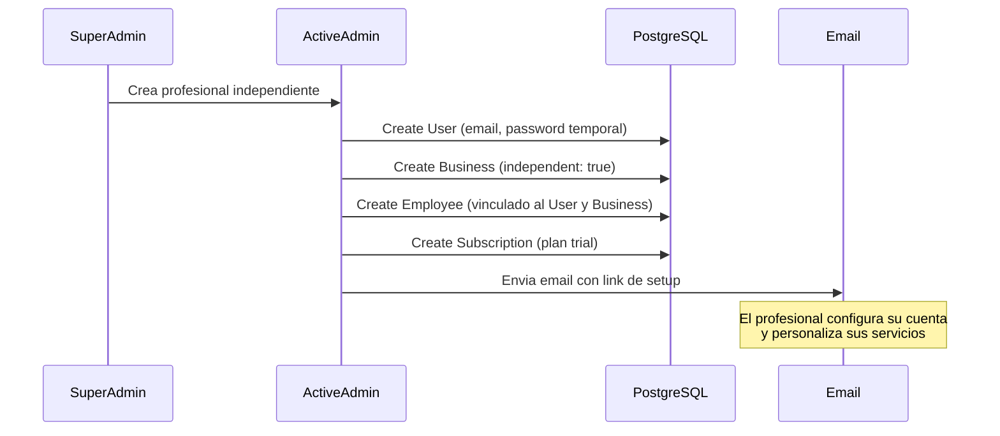

# Profesional Independiente

> Ultima actualizacion: 2026-03-22

## Contexto

Un profesional independiente (barbero, estilista) que trabaja por cuenta propia sin un local/negocio. En Agendity se modela como un `Business` con `independent: true`.

Esto permite cubrir un segmento importante del mercado: profesionales que atienden a domicilio, en espacios compartidos o que simplemente no tienen un establecimiento propio, pero necesitan gestionar sus citas y clientes de forma profesional.

---

## Decision arquitectonica

Se reutiliza el modelo `Business` en vez de crear un sistema paralelo.

### Justificacion

- Evita duplicar toda la logica existente: servicios, citas, pagos, reportes, creditos, cashback, cancelaciones, etc.
- El independiente accede a planes y upgrade normalmente, sin rutas especiales.
- Menor superficie de mantenimiento: un solo flujo de reserva, un solo sistema de notificaciones, un solo dashboard.
- Permite migrar de independiente a negocio (o viceversa) sin perder datos.

### Alternativas descartadas

- **Modelo `Professional` separado:** Duplicaria la logica de `Business` y requeriria mantener dos sistemas en paralelo para citas, pagos, reportes, etc.
- **Flag en `User`:** No escala porque la logica de negocio esta en `Business`, no en `User`.

---

## Diferencias con un negocio regular

| Aspecto | Negocio | Independiente |
|---|---|---|
| Pagina publica | Si (visible en Explore) | Solo link de agendamiento (no aparece en Explore) |
| Direccion/mapa | Requerido | Opcional |
| Empleados | Multiples | Solo el mismo (1 employee) |
| Nombre publico | Nombre del negocio | Nombre del profesional |
| NIT | Opcional | No aplica |
| Representante legal | Si | No aplica (el es el representante) |
| Registro | Self-service o SuperAdmin | SuperAdmin crea manualmente |

---

## Modelo de datos

### Business

| Campo | Tipo | Descripcion |
|---|---|---|
| `independent` | `boolean` | `true` para profesionales independientes |
| `nit` | `string` | NIT del negocio (no aplica para independientes) |
| `legal_representative_name` | `string` | Nombre del representante legal |
| `legal_representative_document` | `string` | Documento del representante legal |
| `legal_representative_document_type` | `string` | Tipo de documento del representante |

### Employee

| Campo | Tipo | Descripcion |
|---|---|---|
| `document_number` | `string` | Numero de documento del empleado/profesional |
| `document_type` | `string` | Tipo de documento (CC, CE, etc.) |
| `fiscal_address` | `string` | Direccion fiscal del profesional |

---

## Flujo de creacion (SuperAdmin)

### Pasos detallados

1. **SuperAdmin** accede a ActiveAdmin y crea el profesional independiente.
2. Se crean automaticamente:
   - `User` con email y password temporal
   - `Business` con `independent: true`
   - `Employee` vinculado al `User` y al `Business`
   - `Subscription` en periodo trial
3. Se genera un link de setup y se envia por email al profesional.
4. El profesional accede, configura su perfil, servicios y horarios.

---

## Frontend

### Pagina publica simplificada

- No muestra direccion ni mapa (son opcionales para independientes).
- No aparece en el directorio Explore.
- Accesible unicamente mediante link directo de agendamiento.

### Dashboard

- No muestra seccion "Empleados" (el independiente es su unico empleado).
- El resto del dashboard funciona igual: citas, servicios, reportes, configuracion.

### Onboarding simplificado

- No pide datos de negocio como NIT o representante legal.
- Flujo enfocado en: nombre, servicios, horarios, metodos de pago.

---

## Planes

Los independientes acceden a los mismos planes que los negocios regulares:

| Plan | Uso esperado |
|---|---|
| **Basico** | Entrada natural para independientes. Gestion de citas y servicios. |
| **Profesional** | Upgrade para independientes que quieren reportes, cierre de caja, creditos. |
| **Inteligente** | Para independientes que quieren tarifas dinamicas e IA. |

### Estrategia comercial

- El **Plan Basico** funciona como puerta de entrada para captar independientes.
- El upgrade a **Profesional** o **Inteligente** se ofrece conforme el profesional crece y necesita mas herramientas.
- Los limites de cada plan aplican igual que para negocios regulares.
