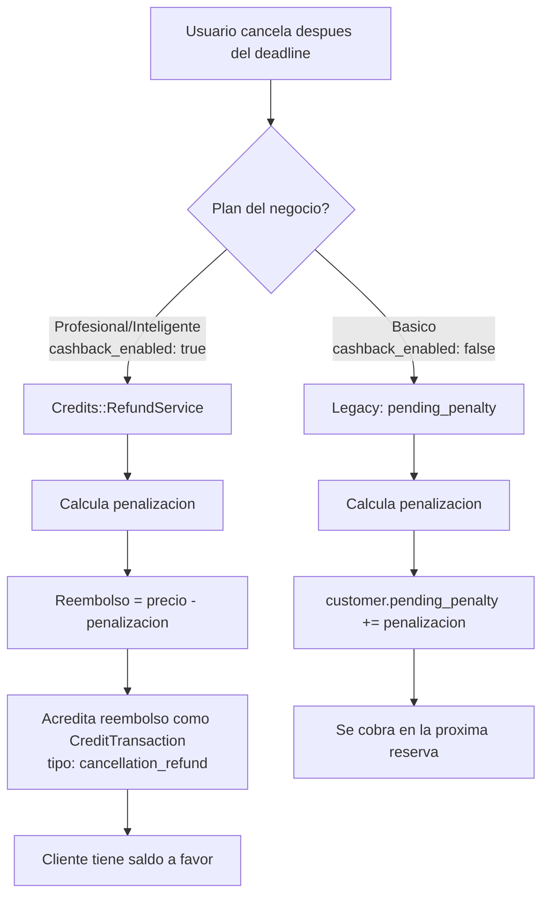

# Sistema de Cancelaciones y Penalizaciones

> Ultima actualizacion: 2026-03-22

## Resumen

El sistema de cancelaciones permite tanto al negocio como al usuario final cancelar citas, con penalizacion configurable. El comportamiento de la penalizacion depende del plan del negocio:

- **Plan Profesional/Inteligente (con cashback):** la penalizacion se descuenta del reembolso, y el resto se acredita como creditos al cliente
- **Plan Basico (sin cashback):** la penalizacion se acumula en `pending_penalty` y se cobra en la siguiente reserva

---

## Reglas de negocio

### 1. Cancelacion por el negocio (desde dashboard)

- El negocio puede cancelar **cualquier cita en cualquier momento**
- **NO genera penalizacion** al usuario final
- **NO genera creditos** al usuario final
- El slot se libera inmediatamente
- Se envia notificacion al usuario final (email + WhatsApp)
- Se registra `cancelled_by: 'business'`

### 2. Cancelacion por el usuario final (desde ticket)

- El usuario puede cancelar desde la pagina del ticket (`/[slug]/ticket/[code]`)
- Si cancela **antes** del plazo limite (`cancellation_deadline_hours`): **sin penalizacion**
- Si cancela **despues** del plazo: **penalizacion = precio x cancellation_policy_pct / 100**
- Se registra `cancelled_by: 'customer'`

### 3. Que pasa con el dinero — depende del plan



---

## Comparacion por plan

| Aspecto | Basico | Profesional / Inteligente |
|---|---|---|
| **Cancelacion por negocio** | Sin penalizacion | Sin penalizacion |
| **Cancelacion por cliente antes del deadline** | Sin penalizacion | Sin penalizacion |
| **Cancelacion por cliente despues del deadline** | Penalizacion se suma a `pending_penalty` | Penalizacion se descuenta del reembolso como credito |
| **Donde se registra la penalizacion** | `customers.pending_penalty` | `CreditTransaction` (tipo: `cancellation_refund`) |
| **Como se cobra** | Se suma al precio de la proxima cita | El credito se puede usar en futuras reservas |
| **Ejemplo: servicio $40,000, penalizacion 30%** | pending_penalty += $12,000 | Credito: $28,000 (reembolso) |

### Ejemplo detallado

**Servicio:** Corte + barba $40,000 COP
**Politica:** 30% penalizacion, 24h deadline

#### Plan Basico:
1. Cliente cancela 2 horas antes (despues del deadline)
2. Penalizacion: $40,000 x 30% = $12,000
3. `customer.pending_penalty` pasa de $0 a $12,000
4. Proxima reserva: corte clasico $25,000 + $12,000 penalizacion = **$37,000 a pagar**
5. `pending_penalty` se resetea a $0

#### Plan Profesional:
1. Cliente cancela 2 horas antes (despues del deadline)
2. Penalizacion: $40,000 x 30% = $12,000
3. Reembolso como credito: $40,000 - $12,000 = **$28,000 en creditos**
4. Se crea `CreditTransaction(amount: 28000, type: cancellation_refund)`
5. El cliente puede usar esos $28,000 en futuras reservas

---

## Configuracion por negocio

Cada negocio configura su politica desde **Settings > Cancelacion**:

| Campo | Tipo | Descripcion | Default |
|---|---|---|---|
| `cancellation_policy_pct` | integer | Porcentaje de penalizacion (0-100) | `0` |
| `cancellation_deadline_hours` | integer | Horas antes de la cita para cancelar sin penalizacion | `24` |

> **Nota:** El cashback y reembolso como credito lo controla el **SuperAdmin** desde el Plan en ActiveAdmin (`cashback_enabled`). El negocio NO configura esto.

---

## Flujo tecnico

### CancelAppointmentService

```ruby
# Flujo simplificado
if cancelled_by == "customer"
  penalty = calculate_penalty  # basado en deadline + policy_pct
  plan = business.current_plan

  if plan.cashback_enabled? && customer.present?
    # Plan Profesional+: reembolso como credito
    Credits::RefundService.call(appointment: appointment)
    # RefundService calcula: refund = price - penalty
    # Crea CreditTransaction con el refund amount
  elsif penalty > 0
    # Plan Basico: legacy pending_penalty
    customer.increment!(:pending_penalty, penalty)
  end
end
```

### Credits::RefundService

```ruby
# Solo se ejecuta si plan.cashback_enabled?
penalty_pct = business.cancellation_policy_pct
penalty_amount = (price * penalty_pct / 100).round(2)
refund_amount = (price - penalty_amount).round(2)

if refund_amount > 0
  account.credit!(refund_amount, type: :cancellation_refund)
end
```

---

## Casos especiales

| Caso | Resultado |
|---|---|
| `cancellation_policy_pct = 0` | Sin penalizacion, sin credito |
| Cita en `pending_payment` | No aplica penalizacion (no pago nada) |
| Penalizaciones acumuladas (plan Basico) | Se suman en `pending_penalty` |
| Plan Basico → upgrade a Profesional | Las `pending_penalty` existentes siguen funcionando, nuevas cancelaciones generan creditos |
| Negocio cancela | Nunca penalizacion, nunca credito |

---

## Endpoints

### Cancelacion por el negocio (autenticado)

```bash
POST /api/v1/appointments/:id/cancel
Authorization: Bearer <token>
Content-Type: application/json

{"cancellation_reason": "El barbero no puede atender hoy"}
```

### Cancelacion por el usuario final (publico)

```bash
POST /api/v1/public/tickets/:code/cancel
```

---

## Modelo de datos

### Tabla `appointments`

| Campo | Tipo | Descripcion |
|---|---|---|
| `cancelled_by` | string (nullable) | `'business'` o `'customer'` |
| `cancellation_reason` | text (nullable) | Motivo de cancelacion |
| `status` | enum | Cambia a `cancelled` |

### Tabla `customers`

| Campo | Tipo | Descripcion |
|---|---|---|
| `pending_penalty` | decimal(10,2) | Penalizacion acumulada (solo Plan Basico). Default: `0` |

### Tabla `credit_transactions` (Plan Profesional+)

| Campo | Valor |
|---|---|
| `transaction_type` | `cancellation_refund` |
| `amount` | Precio - penalizacion (positivo) |
| `description` | "Reembolso por cancelacion — {servicio}" |
| `appointment_id` | Referencia a la cita cancelada |

### Tabla `plans`

| Campo | Tipo | Descripcion |
|---|---|---|
| `cashback_enabled` | boolean | Determina si se usa creditos o pending_penalty |

---

## Relacion con otros sistemas

- **Sistema de creditos** → ver [cierre-de-caja.md](cierre-de-caja.md): creditos y cashback
- **Notificaciones** → ver [notificaciones.md](notificaciones.md): MultiChannelService envia email + WhatsApp
- **Concurrencia de slots** → ver [concurrencia-slots.md](concurrencia-slots.md): al cancelar se libera el slot
- **Planes** → `plan.cashback_enabled?` determina el comportamiento del reembolso

---

## Archivos relevantes

| Archivo | Responsabilidad |
|---|---|
| `app/services/appointments/cancel_appointment_service.rb` | Logica de cancelacion: decide credito vs penalty segun plan |
| `app/services/credits/refund_service.rb` | Calcula reembolso como credito (Profesional+) |
| `app/controllers/api/v1/appointments_controller.rb` | Endpoint autenticado para cancelacion por negocio |
| `app/controllers/api/v1/public/tickets_controller.rb` | Endpoint publico para cancelacion por usuario |
| `app/services/appointments/create_appointment_service.rb` | Cobra `pending_penalty` en nueva cita (Basico) |
