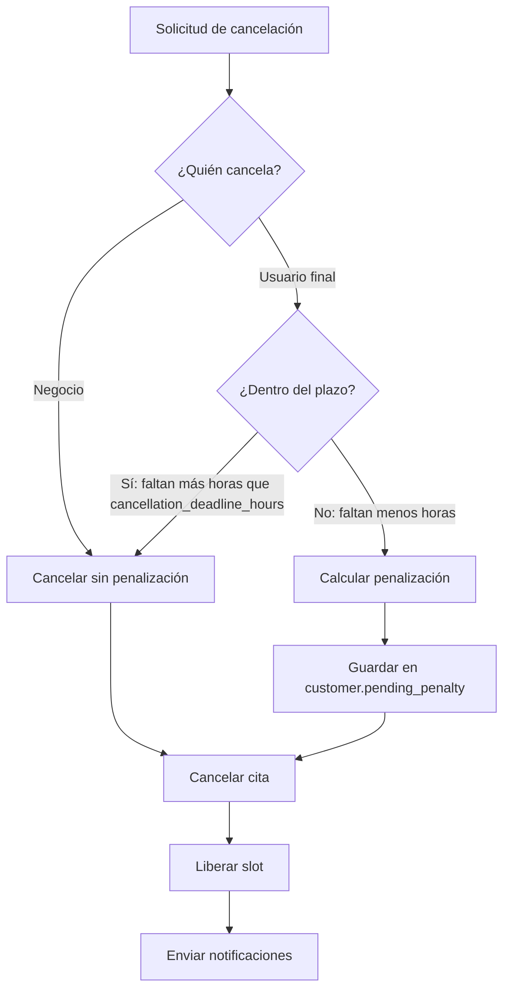
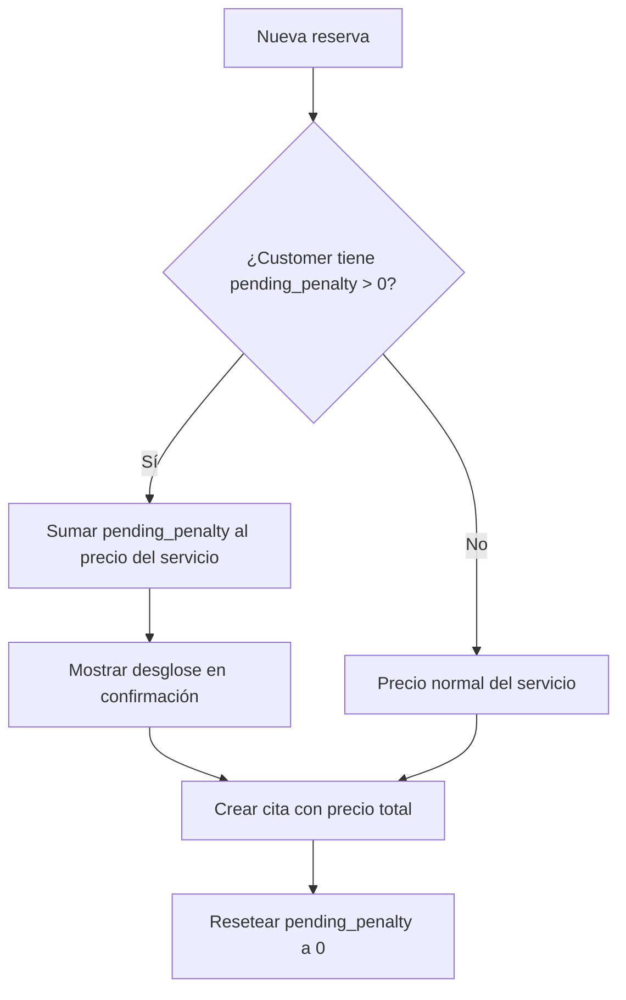

# Sistema de Cancelaciones y Penalizaciones

> Última actualización: 2026-03-16

## Resumen

El sistema de cancelaciones permite tanto al negocio (cliente) como al usuario final cancelar citas, con un mecanismo de penalización configurable por cada negocio. Las penalizaciones se acumulan en el registro del usuario final y se cobran en su siguiente reserva.

---

## Reglas de negocio

### 1. Cancelación por el negocio (desde dashboard)

- El negocio puede cancelar **cualquier cita en cualquier momento**
- **NO genera penalización** al usuario final
- El slot se libera inmediatamente (se elimina el Redis lock si existe)
- Se envía notificación al usuario final (email + in-app)
- Se registra `cancelled_by: 'business'` en la cita

### 2. Cancelación por el usuario final (desde ticket)

- El usuario puede cancelar su cita desde la página del ticket (`/[slug]/ticket/[code]`)
- Si cancela **antes** del plazo límite (`cancellation_deadline_hours`): **sin penalización**
- Si cancela **después** del plazo: **penalización = precio del servicio × (cancellation_policy_pct / 100)**
- Se registra `cancelled_by: 'customer'` en la cita
- Se envía notificación al negocio (email + in-app)

### 3. Penalización pendiente

- Se almacena en `customers.pending_penalty` (decimal)
- Al crear una nueva cita, se suma la penalización pendiente al precio del servicio
- Se muestra al usuario en la pantalla de confirmación de reserva
- Se resetea a `0` después de aplicarse al crear la nueva cita

---

## Configuración por negocio

Cada negocio configura su política de cancelación desde **Settings > Cancelación** en el dashboard.

| Campo | Tipo | Descripción | Default |
|---|---|---|---|
| `cancellation_policy_pct` | integer | Porcentaje de penalización (0, 30, 50, 100) | `0` |
| `cancellation_deadline_hours` | integer | Horas antes de la cita para cancelar sin penalización | `24` |

**Ejemplo:** Si un negocio tiene `cancellation_policy_pct: 50` y `cancellation_deadline_hours: 24`:
- Un corte de cabello cuesta $30.000 COP
- Si el usuario cancela con menos de 24h de anticipación, se le aplica una penalización de $15.000 COP
- Esos $15.000 se suman al precio de su próxima reserva

---

## Flujo técnico



### Flujo de cobro de penalización en nueva reserva



---

## Cálculo de penalización

```ruby
# Pseudocódigo del cálculo
if cancelled_by == 'business'
  penalty = 0
elsif time_until_appointment > business.cancellation_deadline_hours.hours
  penalty = 0
else
  penalty = appointment.price * (business.cancellation_policy_pct / 100.0)
end

customer.pending_penalty += penalty
```

### Casos especiales

- Si `cancellation_policy_pct` es `0`, nunca se genera penalización (política desactivada)
- Si la cita está en estado `pending_payment` (no pagada), no se aplica penalización
- La penalización se acumula: si el usuario cancela dos citas tarde, ambas penalizaciones se suman

---

## Endpoints

### Cancelación por el negocio (autenticado)

```
POST /api/v1/appointments/:id/cancel
Authorization: Bearer <token>
```

- Requiere autenticación JWT del negocio
- Valida que la cita pertenezca al negocio (Pundit policy)
- Establece `cancelled_by: 'business'`
- No genera penalización

### Cancelación por el usuario final (público)

```
POST /api/v1/public/tickets/:code/cancel
```

- Endpoint público, no requiere autenticación
- Se identifica la cita por el código único del ticket
- Evalúa si aplica penalización según la política del negocio
- Establece `cancelled_by: 'customer'`

---

## Modelo de datos

### Tabla `appointments`

| Campo | Tipo | Descripción |
|---|---|---|
| `cancelled_by` | string (nullable) | `'business'` o `'customer'`. `NULL` si no está cancelada |
| `status` | string | Cambia a `'cancelled'` al cancelar |

### Tabla `customers`

| Campo | Tipo | Descripción |
|---|---|---|
| `pending_penalty` | decimal(10,2) | Monto acumulado pendiente de cobrar. Default: `0` |

### Tabla `businesses`

| Campo | Tipo | Descripción |
|---|---|---|
| `cancellation_policy_pct` | integer | Porcentaje de penalización: 0, 30, 50, 100. Default: `0` |
| `cancellation_deadline_hours` | integer | Horas límite para cancelar sin penalización. Default: `24` |

---

## Notificaciones

| Evento | Destinatario | Canales |
|---|---|---|
| Cita cancelada por el negocio | Usuario final | Email + in-app |
| Cita cancelada por el usuario (sin penalización) | Negocio | Email + in-app |
| Cita cancelada por el usuario (con penalización) | Negocio | Email + in-app (incluye monto de penalización) |

### Cuerpo de la notificación

El texto del cuerpo varía según quién canceló:
- **Negocio cancela** → `"Cancelada por [nombre del negocio]"`
- **Usuario cancela** → `"El cliente canceló"`

---

## Archivos relevantes

### Backend (agendify-api)

| Archivo | Responsabilidad |
|---|---|
| `app/services/appointments/cancel_appointment_service.rb` | Lógica de cancelación: determina penalización, actualiza customer, cambia estado |
| `app/controllers/api/v1/appointments_controller.rb` | Endpoint autenticado para cancelación por el negocio |
| `app/controllers/api/v1/public/tickets_controller.rb` | Endpoint público `#cancel` para cancelación por el usuario final |
| `app/services/appointments/create_appointment_service.rb` | Verifica `pending_penalty` al crear cita y lo suma al precio |
| `app/models/customer.rb` | Campo `pending_penalty` |
| `app/models/business.rb` | Campos `cancellation_policy_pct` y `cancellation_deadline_hours` |

### Frontend (agendify-web)

| Archivo | Responsabilidad |
|---|---|
| `src/app/[slug]/ticket/[code]/page.tsx` | Página del ticket con botón de cancelar para el usuario final |
| `src/components/agenda/appointment-detail-modal.tsx` | Modal de detalle de cita con botón de cancelar para el negocio |

---

## Relación con otros sistemas

- **Sistema de pagos P2P** → ver [sistema-pagos-p2p.md](sistema-pagos-p2p.md): si la cita estaba en `pending_payment`, no aplica penalización
- **Concurrencia de slots** → ver [concurrencia-slots.md](concurrencia-slots.md): al cancelar se libera el slot y el Redis lock
- **Notificaciones** → ver [notificaciones.md](notificaciones.md): jobs de Sidekiq envían email + in-app al cancelar
- **Sistema de planes** → ver [sistema-planes.md](sistema-planes.md): la política de cancelación configurable está disponible en planes Profesional e Inteligente
