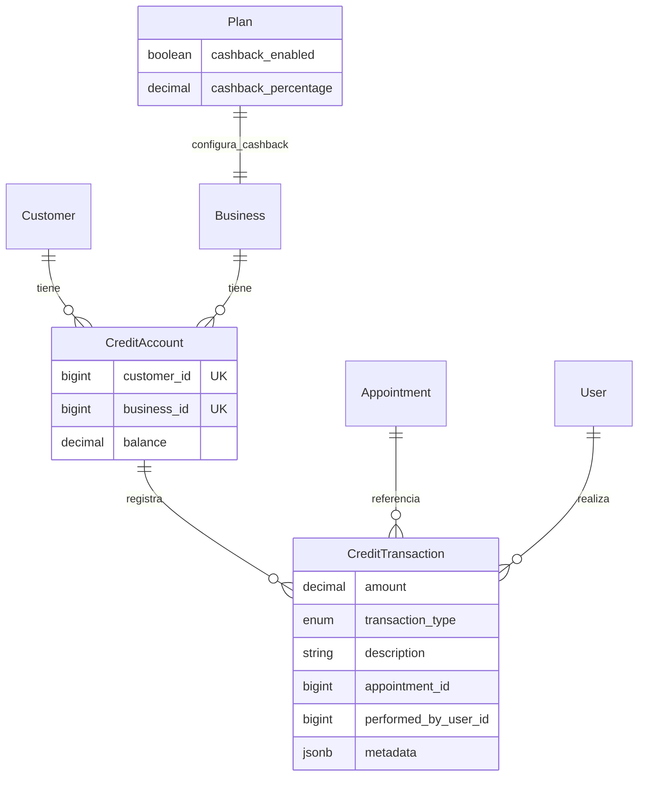
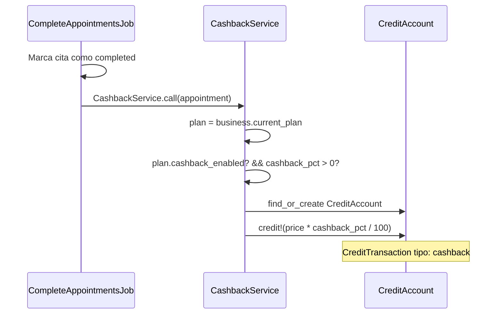
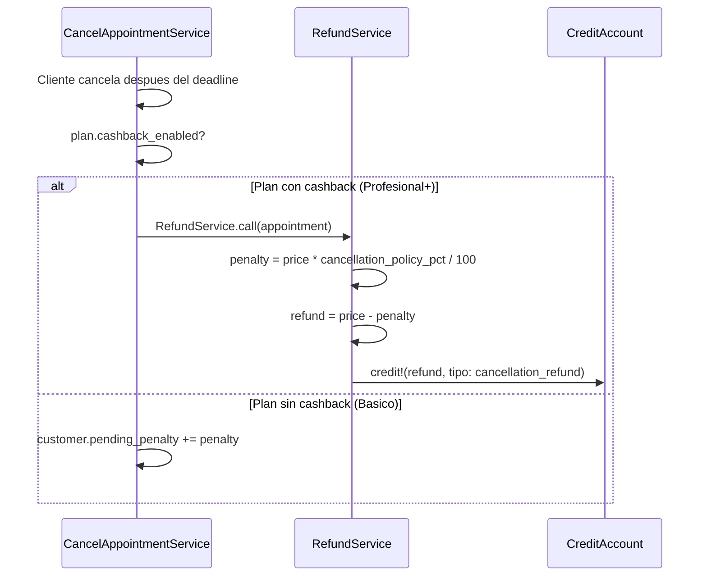

# Sistema de Creditos y Cashback — Agendity

> Ultima actualizacion: 2026-03-22
> Disponible desde: **Plan Profesional+**
> Configurado por: **SuperAdmin** (desde ActiveAdmin en el Plan)

## Resumen

Sistema de fidelizacion donde los clientes (usuarios finales) acumulan creditos que pueden usar en futuras reservas. Los creditos se generan automaticamente por cashback al completar servicios, por reembolso de cancelaciones, o manualmente por el negocio.

**Principio clave:** El cashback lo configura el SuperAdmin en el Plan, no el negocio. Todos los negocios del mismo plan tienen el mismo porcentaje.

---

## Modelo de datos



### CreditAccount

```sql
CREATE TABLE credit_accounts (
  id bigint PRIMARY KEY,
  customer_id bigint NOT NULL REFERENCES customers(id),
  business_id bigint NOT NULL REFERENCES businesses(id),
  balance decimal(12,2) DEFAULT 0 NOT NULL,
  timestamps
);
CREATE UNIQUE INDEX ON credit_accounts(customer_id, business_id);
```

- Un CreditAccount por par (customer, business)
- Balance siempre >= 0 (validacion en modelo)
- Metodos: `credit!(amount, ...)` y `debit!(amount, ...)`

### CreditTransaction

```sql
CREATE TABLE credit_transactions (
  id bigint PRIMARY KEY,
  credit_account_id bigint NOT NULL REFERENCES credit_accounts(id),
  amount decimal(12,2) NOT NULL,      -- positivo = credito, negativo = debito
  transaction_type integer NOT NULL,   -- enum
  description varchar,
  appointment_id bigint REFERENCES appointments(id),
  performed_by_user_id bigint REFERENCES users(id),
  metadata jsonb DEFAULT '{}',
  timestamps
);
```

**Tipos de transaccion:**

| Tipo | Valor | Monto | Descripcion |
|---|---|---|---|
| `cashback` | 0 | + | % del servicio completado |
| `cancellation_refund` | 1 | + | Reembolso por cancelacion (menos penalizacion) |
| `penalty_deduction` | 2 | - | Penalizacion por cancelacion tardia |
| `manual_adjustment` | 3 | +/- | Ajuste manual del negocio |
| `redemption` | 4 | - | Creditos usados al reservar |

### Plan (campos de cashback)

```sql
-- En tabla plans (configurado por SuperAdmin):
cashback_enabled boolean DEFAULT false    -- true para Profesional+
cashback_percentage decimal(5,2) DEFAULT 0 -- ej: 5 = 5%
```

---

## Configuracion

El cashback se configura **por plan** desde ActiveAdmin:

| Plan | cashback_enabled | cashback_percentage |
|---|---|---|
| Basico | false | 0 |
| Profesional | true | 5% |
| Inteligente | true | 5% |

El negocio **NO puede** cambiar estos valores. El SuperAdmin los modifica desde el recurso Plan en ActiveAdmin.

---

## Flujos automaticos

### 1. Cashback al completar cita



### 2. Reembolso por cancelacion



---

## API Endpoints

Todos requieren autenticacion JWT.

### GET /api/v1/credits/summary

Cuentas con balance positivo del negocio.

```bash
curl -H "Authorization: Bearer $TOKEN" \
  "http://localhost:3001/api/v1/credits/summary"
```

**Respuesta:**
```json
{
  "data": [
    {
      "id": 1,
      "customer_id": 5,
      "business_id": 1,
      "balance": "4750.0",
      "customer_name": "Juan Herrera",
      "customer_email": "juan.herrera@gmail.com"
    }
  ]
}
```

### GET /api/v1/customers/:id/credits

Balance y historial de transacciones de un cliente.

```bash
curl -H "Authorization: Bearer $TOKEN" \
  "http://localhost:3001/api/v1/customers/5/credits"
```

**Respuesta:**
```json
{
  "data": {
    "balance": 4750.0,
    "transactions": [
      {
        "id": 1,
        "amount": 1250.0,
        "transaction_type": "cashback",
        "description": "Cashback 5% — Corte clasico ($25,000)",
        "appointment_id": 42,
        "performed_by": null,
        "created_at": "2026-03-22T..."
      }
    ]
  }
}
```

### POST /api/v1/customers/:id/credits/adjust

Ajuste manual del balance de un cliente.

```bash
curl -X POST -H "Authorization: Bearer $TOKEN" \
  -H "Content-Type: application/json" \
  -d '{"amount": 5000, "description": "Bonificacion por cliente frecuente"}' \
  "http://localhost:3001/api/v1/customers/5/credits/adjust"
```

- `amount` positivo = agregar creditos
- `amount` negativo = quitar creditos (falla si saldo insuficiente)

### GET /api/v1/customers/:id/credit_balance

Consulta rapida del balance (para modal de nueva cita).

```bash
curl -H "Authorization: Bearer $TOKEN" \
  "http://localhost:3001/api/v1/customers/5/credit_balance"
```

### POST /api/v1/credits/bulk_adjust

Aplica credito a multiples clientes o a todos.

```bash
# A clientes especificos
curl -X POST -H "Authorization: Bearer $TOKEN" \
  -H "Content-Type: application/json" \
  -d '{"customer_ids": [5, 8, 12], "amount": 3000, "description": "Promocion de apertura"}' \
  "http://localhost:3001/api/v1/credits/bulk_adjust"

# A todos los clientes del negocio
curl -X POST -H "Authorization: Bearer $TOKEN" \
  -H "Content-Type: application/json" \
  -d '{"amount": 2000, "description": "Credito de bienvenida"}' \
  "http://localhost:3001/api/v1/credits/bulk_adjust"
```

**Respuesta:**
```json
{
  "data": {
    "message": "Credito aplicado a 10 clientes",
    "count": 10
  }
}
```

---

## Frontend

### Pagina /dashboard/credits

- **Resumen:** Total creditos en circulacion
- **Tabla:** Clientes con balance > 0 (nombre, email, balance, acciones)
- **Acciones por cliente:**
  - Historial: modal con todas las transacciones (tipo, monto, fecha)
  - Ajustar: modal para agregar o quitar creditos manualmente

### Boton "Abrir credito"

Modal en dos pasos:

**Paso 1 — Seleccionar destinatarios:**
- Toggle "Aplicar a todos los clientes" (para promociones)
- O buscar y agregar clientes individuales (chips con X para remover)
- Boton "Continuar"

**Paso 2 — Monto y descripcion:**
- Input "Monto por cliente"
- Input "Descripcion"
- Boton "Dar $X a N clientes"

### Sidebar
- Entrada "Creditos" con icono Coins

---

## Servicios

| Servicio | Trigger | Descripcion |
|---|---|---|
| `Credits::CashbackService` | CompleteAppointmentsJob | Otorga % cashback del plan al customer |
| `Credits::RefundService` | CancelAppointmentService | Reembolsa cancelacion como credito (menos penalty) |
| `Credits::AdjustService` | Manual (negocio) | Ajuste positivo o negativo del balance |

---

## Seeds de ejemplo

Las seeds crean 6 escenarios para Barberia Elite:

| Cliente | Caso | Balance |
|---|---|---|
| Juan Herrera | 3 cashback de servicios completados | $4,750 |
| Pedro Martinez | Reembolso por cancelacion ($40k - 30% penalty) | $28,000 |
| Luis Rodriguez | Cashback + redencion parcial | $2,500 |
| Diego Ramirez | Cashback + bonificacion manual | $6,250 |
| Sebastian Diaz | Cashback + correccion negativa | $1,500 |
| Alejandro Gomez | Cashback + redencion total | $0 (no aparece) |
