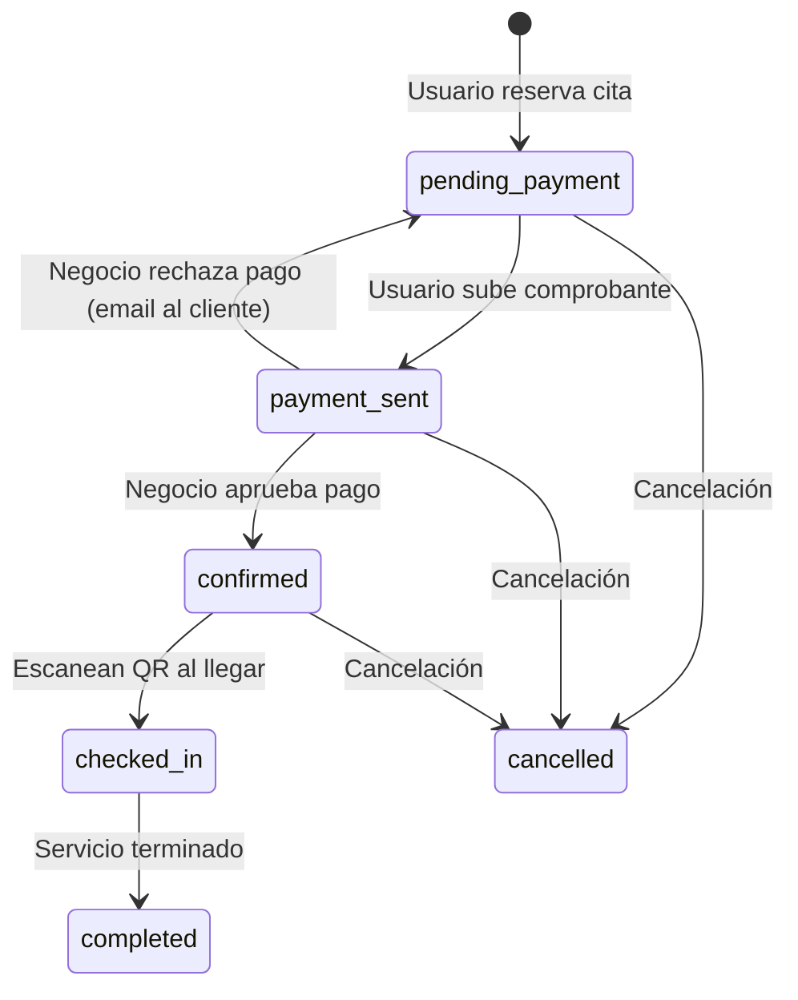

# Sistema de Pagos P2P — Agendity

> Última actualización: 2026-03-16

## Resumen

Agendity NO usa pasarela de pago. Los pagos son **peer-to-peer**: el usuario final paga directamente al negocio (transferencia bancaria, Nequi, Daviplata, o efectivo) y sube un comprobante. El negocio aprueba o rechaza desde su dashboard.

---

## Flujo completo



---

## Estados de la cita (Appointment)

| Estado | Significado | Quién lo cambia |
|---|---|---|
| `pending_payment` | Reservada, esperando pago | Sistema (al crear cita) |
| `payment_sent` | Comprobante subido | Usuario final |
| `confirmed` | Pago aprobado → ticket generado | Negocio (dashboard) |
| `checked_in` | Cliente llegó, QR escaneado | Negocio (escaneo QR) |
| `completed` | Servicio realizado | Negocio |
| `cancelled` | Cita cancelada | Negocio o usuario |

## Estados del pago (Payment)

| Estado | Significado |
|---|---|
| `pending` | Esperando que el usuario pague |
| `submitted` | Comprobante subido |
| `approved` | Negocio confirmó el pago |
| `rejected` | Comprobante rechazado |

---

## Datos de pago del negocio

Configurados en Settings → Métodos de pago:

```json
{
  "nequi_phone": "+573001234567",
  "daviplata_phone": "+573001234567",
  "bancolombia_account": "12345678901",
  "payment_instructions": "Transferir a Nequi: 300-123-4567 a nombre de Carlos Méndez"
}
```

Estos datos se muestran al usuario final en:
- **Paso de confirmación del booking flow** (después de reservar)
- **Página del ticket** (`/{slug}/ticket/{code}`) cuando el estado es `pending_payment`

Las instrucciones incluyen iconos de Nequi/Daviplata/Bancolombia con botones de copiar para cada número/cuenta.

---

## Frontend: Página de gestión de pagos

**Ruta:** `/dashboard/payments`

### 4 Tabs

| Tab | Clave | Filtra por | Descripción |
|---|---|---|---|
| **Pendientes** | `proofs` | `status: payment_sent` | Comprobantes subidos esperando revisión del negocio |
| **Sin comprobante** | `waiting` | `status: pending_payment` | Citas reservadas donde el cliente aún no sube comprobante |
| **Aprobados** | `approved` | `status: confirmed` | Pagos ya aprobados por el negocio |
| **Rechazados** | `rejected` | `payment_status: rejected` | Pagos rechazados (la cita vuelve a `pending_payment`) |

### Búsqueda

El negocio puede buscar pagos por:
- Nombre del cliente
- Teléfono del cliente
- Código de ticket

La búsqueda filtra en tiempo real sobre los resultados del tab activo.

### Ticket code en cada tarjeta

Cada tarjeta de pago muestra el **código de ticket** de forma prominente en la parte superior (icono `#` + código en monospace bold).

### Recordatorio de 15 minutos (tab "Sin comprobante")

Si un cliente lleva más de 15 minutos sin subir comprobante, el negocio puede hacer clic en **"Notificar al cliente"**, que envía un email recordatorio.

- **Endpoint:** `POST /api/v1/appointments/:id/remind_payment`
- **Validaciones:** requiere que el cliente tenga email y que la cita esté en `pending_payment`
- **Mailer:** `AppointmentMailer#payment_reminder`
- Si han pasado menos de 15 minutos, solo se muestra el texto "El cliente aún no ha enviado su comprobante"

### Acciones en tab "Pendientes"

- **Ver comprobante** — abre modal con zoom de la imagen
- **Aprobar** → confirma pago → genera ticket digital VIP
- **Rechazar** → muestra modal pidiendo motivo (opcional) → envía email al cliente → revierte cita a `pending_payment`

### Flujo de rechazo

1. El negocio hace clic en "Rechazar" en una tarjeta del tab "Pendientes"
2. Se muestra un modal pidiendo el motivo del rechazo (campo opcional)
3. Se envía `POST /api/v1/payments/:id/reject` con `{ rejection_reason: "..." }`
4. El backend:
   - Cambia el pago a `status: rejected` con `rejection_reason` y `rejected_at`
   - Revierte la cita a `pending_payment`
   - Envía email al cliente: "Tu comprobante fue rechazado. Motivo: [razón]. Sube un nuevo comprobante."
5. El cliente ve en la página del ticket un aviso rojo indicando el rechazo y puede subir un nuevo comprobante

---

## Frontend: Página del ticket (usuario final)

**Ruta:** `/{slug}/ticket/{code}`

La página del ticket muestra diferentes vistas según el estado de la cita:

| Estado | Vista |
|---|---|
| `pending_payment` | Instrucciones de pago + zona de upload de comprobante. Si hubo un rechazo previo, muestra alerta roja con el motivo |
| `payment_sent` | "Comprobante en revisión" — mensaje de espera |
| `confirmed` | Ticket VIP completo con QR, botones descargar/compartir |
| `checked_in` | "Ya te registraste" — confirmación de llegada |
| `completed` | "Servicio completado" — resumen |
| `cancelled` | "Cita cancelada" — con detalle de quién canceló |

### Subida de comprobante in-app

El cliente sube el comprobante directamente desde la página del ticket:

- **Endpoint:** `POST /api/v1/public/tickets/:code/payment`
- **Método:** `multipart/form-data` con campos `proof` (archivo), `payment_method`, `customer_email`
- **Validación de identidad:** `customer_email` debe coincidir con el email de la reserva
- **Almacenamiento:** ActiveStorage guarda la imagen adjunta
- **Límite:** 5 MB máximo por archivo
- **UX:** Zona de drag & drop + tap para seleccionar, preview de la imagen antes de enviar

### Detección de rechazo previo

Cuando la cita está en `pending_payment` y tiene un pago con `status: 'rejected'`:
- Se muestra una alerta roja: "Tu comprobante anterior fue rechazado. [Motivo si existe]. Sube un nuevo comprobante."
- Se muestra la zona de upload normalmente para que el cliente reintente

---

## Backend: Services involucrados

### `Payments::SubmitPaymentService`
```ruby
# Crea Payment (status: submitted) + actualiza Appointment a payment_sent
def call
  payment = Payment.create!(
    appointment: @appointment,
    payment_method: @payment_method,
    amount: @amount,
    proof_image_url: @proof_image_url,
    status: :submitted
  )
  @appointment.update!(status: :payment_sent)
  success(payment)
end
```

### `Payments::ApprovePaymentService`
```ruby
# Aprueba Payment + confirma Appointment
# Nota: ticket_code ya fue generado al crear la cita (siempre se genera)
def call
  @payment.update!(status: :approved)
  @payment.appointment.update!(status: :confirmed)
  success(@payment)
end
```

### `Payments::RejectPaymentService`
```ruby
# Rechaza Payment + revierte Appointment a pending_payment + envía email al cliente
def call
  ActiveRecord::Base.transaction do
    @payment.update!(status: :rejected, rejection_reason: @reason, rejected_at: Time.current)
    @payment.appointment.update!(status: :pending_payment)
    # Envía email de notificación al cliente
    AppointmentMailer.payment_rejected(@payment.appointment, @reason).deliver_later
    success(@payment)
  end
end
```

---

## API Endpoints

### Subir comprobante (negocio autenticado)
```bash
POST /api/v1/appointments/:appointment_id/payments/submit
Authorization: Bearer <token>
Content-Type: application/json
Body: { "payment_method": "transfer", "amount": 25000, "proof_image_url": "https://..." }
```

### Subir comprobante (usuario final, público, sin auth)
```bash
POST /api/v1/public/tickets/:code/payment
Content-Type: multipart/form-data
Body: proof (file), payment_method, customer_email
```

### Aprobar pago (negocio autenticado)
```bash
POST /api/v1/payments/:id/approve
Authorization: Bearer <token>
```

### Rechazar pago (negocio autenticado)
```bash
POST /api/v1/payments/:id/reject
Authorization: Bearer <token>
Content-Type: application/json
Body: { "rejection_reason": "El comprobante no es legible" }  # opcional
```

### Enviar recordatorio de pago (negocio autenticado)
```bash
POST /api/v1/appointments/:id/remind_payment
Authorization: Bearer <token>
```

---

## Instrucciones de pago

Las instrucciones de pago del negocio se muestran en dos contextos:

1. **Confirmación de reserva** — `BookingConfirmation` usa la vista `with_payment` del `BusinessSerializer` que incluye `nequi_phone`, `daviplata_phone`, `bancolombia_account`
2. **Página del ticket** — cuando `status === 'pending_payment'`, se renderizan las instrucciones con iconos de Nequi/Daviplata/Bancolombia y botón de copiar por cada método

Los datos de pago están encriptados en la base de datos (`Rails.encrypts`): `nequi_phone`, `daviplata_phone`, `bancolombia_account`.

---

## Ticket code y Ticket digital VIP

> **Importante:** El `ticket_code` se genera SIEMPRE al crear la cita (en `CreateAppointmentService`), independientemente del plan del negocio. Esto permite identificar la cita en todo momento (en el tab "Sin comprobante", en emails, en check-in). Lo que es exclusivo del plan Profesional+ es la **visualización VIP** del ticket (diseño boarding pass con QR, descarga PNG, compartir).

El ticket se visualiza en:

**URL:** `/{slug}/ticket/{code}`

**Contenido:** Nombre del cliente, servicio, empleado, fecha/hora, dirección, QR (para check-in).

**Diseño:** Violeta + negro, estilo boarding pass / VIP entry.

**Descarga:** Se puede guardar como imagen PNG (html-to-image) y compartir con Web Share API.

---

## Emails del sistema de pagos

| Email | Mailer method | Destinatario | Cuándo se envía |
|---|---|---|---|
| Recordatorio de pago | `AppointmentMailer#payment_reminder` | Cliente | Negocio hace clic en "Notificar al cliente" (después de 15 min) |
| Comprobante rechazado | `AppointmentMailer#payment_rejected` | Cliente | Negocio rechaza un comprobante |
| Cita confirmada | `AppointmentMailer#booking_confirmed` | Cliente | Negocio aprueba el pago |
