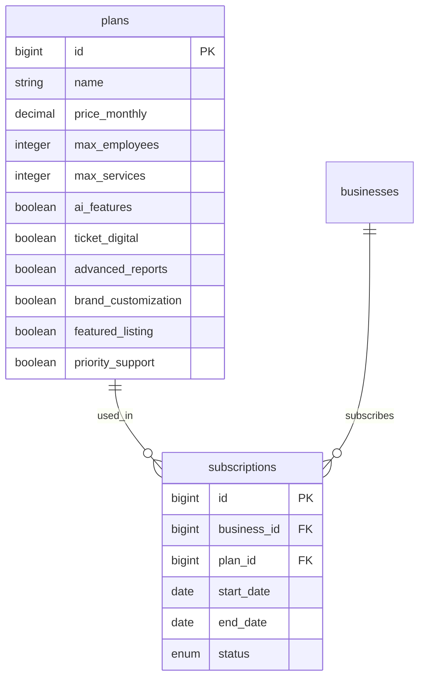

# Sistema de Planes y Suscripciones — Agendify

> Última actualización: 2026-03-16

## Planes disponibles

| | **Básico** | **Profesional** | **Inteligente** |
|---|---|---|---|
| **Precio/mes** | $30.000 COP | $59.900 COP | $99.900 COP |
| Empleados | 3 | 10 | Ilimitado |
| Servicios | 5 | Ilimitado | Ilimitado |
| Agenda y calendario | Sí | Sí | Sí |
| Reservas online | Sí | Sí | Sí |
| Página pública | Sí | Sí | Sí |
| QR de reservas | Sí | Sí | Sí |
| Reportes básicos | Sí | Sí | Sí |
| **Reportes avanzados** | No | **Sí** | **Sí** |
| **Ticket digital VIP** | No | **Sí** | **Sí** |
| **Personalización de marca** | No | **Sí** | **Sí** |
| **Negocio destacado en mapa** | No | **Sí** | **Sí** |
| **Análisis inteligente (IA)** | No | No | **Sí** |
| **Predicción de ingresos** | No | No | **Sí** |
| **Alertas de clientes inactivos** | No | No | **Sí** |
| Soporte | Email | Email + WhatsApp | Prioritario |

**Trial:** 30 días gratis con acceso al Plan Profesional.

---

## Modelo de datos



---

## Frontend: Diferencias visuales por plan

### Badge en topbar

Debajo del nombre del usuario se muestra un pill badge con el plan actual:

| Plan | Color |
|---|---|
| Trial | `blue-100 text-blue-700` |
| Básico | `gray-100 text-gray-600` |
| Profesional | `violet-100 text-violet-700` |
| Inteligente | `amber-100 text-amber-700` |

### Lock icons en sidebar

Features no disponibles en el plan actual muestran un ícono de candado (Lock) en el sidebar. Al hacer clic, se muestra un tooltip: "Disponible en Plan [nombre]".

### Upgrade banner

En páginas restringidas (ej: reportes avanzados para plan Básico), se muestra un banner con gradiente violeta: "Mejora tu plan para acceder a esta función" + botón "Ver planes".

### Restricciones por plan en el frontend

```typescript
// lib/constants.ts
export const PLAN_RESTRICTED_FEATURES: Record<PlanSlug, string[]> = {
  basico: ['/dashboard/reviews', '/dashboard/reports'],
  profesional: [],
  inteligente: [],
  trial: [],
};
```

---

## Backend: Verificación de plan

El serializer del negocio incluye la suscripción activa:

```ruby
# BusinessSerializer
association :current_subscription, blueprint: SubscriptionSerializer
```

La respuesta de `GET /api/v1/business` incluye:

```json
{
  "data": {
    "id": 1,
    "name": "Barbería Elite",
    "current_subscription": {
      "id": 1,
      "status": "active",
      "plan": {
        "name": "Profesional",
        "price_monthly": 59900,
        "max_employees": 10,
        "ai_features": false,
        "advanced_reports": true
      }
    }
  }
}
```

---

## Gestión de planes (ActiveAdmin)

El superusuario puede desde `/admin`:
- Crear/editar/eliminar planes
- Modificar precios y límites
- Asignar suscripciones a negocios
- Cambiar estado de suscripciones
