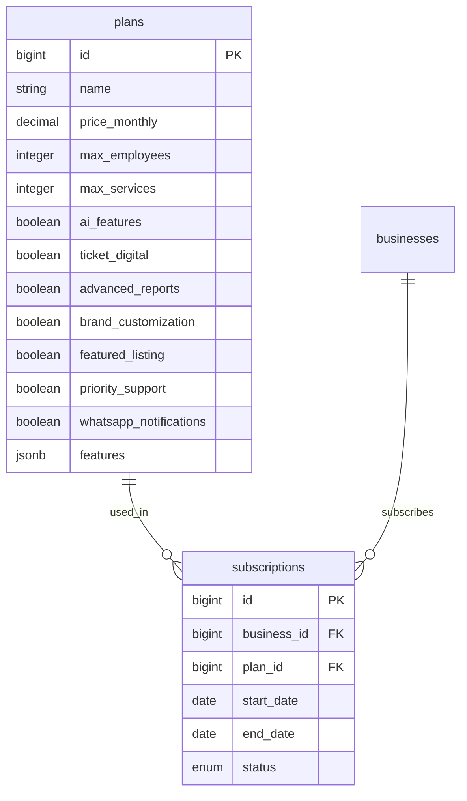

# Sistema de Planes y Suscripciones — Agendity

> Última actualización: 2026-03-26

## Planes disponibles

| | **Básico** | **Profesional** | **Inteligente** |
|---|---|---|---|
| **Precio/mes (USD)** | $9 | $22 | $27 |
| **Precio/mes (COP)** | $33,000 | $82,000 | $99,000 |
| Empleados | 3 | 10 | Ilimitado |
| Servicios | 5 | Ilimitado | Ilimitado |
| Agenda y calendario | Sí | Sí | Sí |
| Reservas online | Sí | Sí | Sí |
| Página pública | Sí | Sí | Sí |
| QR de reservas | Sí | Sí | Sí |
| Reportes básicos | Sí | Sí | Sí |
| **Reportes avanzados** | No | **Sí** | **Sí** |
| **Ticket digital VIP** | No | **Sí** | **Sí** |
| **Personalización de marca** | No | **Sí** | **Sí** |
| **Negocio destacado en mapa** | No | **Sí** | **Sí** |
| **Créditos / Cashback** | No | **Sí** (configurable) | **Sí** (configurable) |
| **Tarifas dinámicas** | No | Manual (fijo/progresivo) | Manual + sugerencias IA |
| **Análisis inteligente (IA)** | No | No | **Sí** |
| **Metas financieras** | No | No | **Sí** |
| **Birthday greeting** | No | No | **Sí** |
| **Predicción de ingresos** | No | No | **Sí** (futuro) |
| **Alertas de clientes inactivos** | No | No | **Sí** (futuro) |
| Soporte | Email | Email + WhatsApp | Prioritario |

**Trial:** 25 días gratis con acceso completo al Plan Profesional. Después elige un plan y paga via checkout P2P.

### Conversión USD → COP

Los precios se definen en USD en la base de datos (`price_monthly`). La conversión a COP se realiza usando la TRM almacenada en `SiteConfig.get(:trm)`, configurable desde ActiveAdmin. El cálculo COP se muestra en checkout, TrialBlockScreen, y landing.

### Campo `features` (jsonb)

Cada plan tiene un campo `features` de tipo jsonb que almacena la lista de features para mostrar en la UI. Es editable desde ActiveAdmin y se expone via el endpoint público `/api/v1/public/plans`.

```json
{
  "features": [
    "Agenda y calendario",
    "Hasta 3 empleados",
    "Hasta 5 servicios",
    "Reservas online",
    "Reportes básicos"
  ]
}
```

### Endpoint público de planes

`GET /api/v1/public/plans` — Retorna todos los planes activos con precios, límites y features. No requiere autenticación. Usado por:
- Landing page (sección de precios)
- Checkout (`/dashboard/subscription/checkout`)
- TrialBlockScreen (pantalla de bloqueo al vencer trial)
- Página pública `/referral`

### Componente PlanCard

Componente compartido reutilizable que renderiza la tarjeta de un plan con:
- Nombre, precio USD y COP
- Lista de features desde el campo jsonb
- Badge "Recomendado" para el plan Inteligente
- Botón de selección
- Indicador del plan actual

Usado en: checkout, TrialBlockScreen, landing page.

---

## Modelo de datos



---

## Frontend: Diferencias visuales por plan

### Badge en topbar

Debajo del nombre del usuario se muestra un pill badge con el plan actual:

| Plan | Color |
|---|---|
| Trial | `blue-100 text-blue-700` |
| Básico | `gray-100 text-gray-600` |
| Profesional | `violet-100 text-violet-700` |
| Inteligente | `amber-100 text-amber-700` |

### Lock icons en sidebar

Features no disponibles en el plan actual muestran un ícono de candado (Lock) en el sidebar. Al hacer clic, se muestra un tooltip: "Disponible en Plan [nombre]".

### Upgrade banner

En páginas restringidas (ej: reportes avanzados para plan Básico), se muestra un banner con gradiente violeta: "Mejora tu plan para acceder a esta función" + botón "Ver planes".

### Restricciones por plan en el frontend

```typescript
// lib/constants.ts
export const PLAN_RESTRICTED_FEATURES: Record<PlanSlug, string[]> = {
  basico: ['/dashboard/reviews', '/dashboard/reports'],
  profesional: [],
  inteligente: [],
  trial: [],
};
```

---

## Backend: Verificación de plan

El serializer del negocio incluye la suscripción activa:

```ruby
# BusinessSerializer
association :current_subscription, blueprint: SubscriptionSerializer
```

La respuesta de `GET /api/v1/business` incluye:

```json
{
  "data": {
    "id": 1,
    "name": "Barbería Elite",
    "current_subscription": {
      "id": 1,
      "status": "active",
      "plan": {
        "name": "Profesional",
        "price_monthly": 22.0,
        "max_employees": 10,
        "ai_features": false,
        "advanced_reports": true,
        "whatsapp_notifications": true,
        "features": ["Agenda y calendario", "Hasta 10 empleados", "Servicios ilimitados", "Ticket digital VIP", "Reportes avanzados"]
      }
    }
  }
}
```

---

## Gestión de planes (ActiveAdmin)

El superusuario puede desde `/admin`:
- Crear/editar/eliminar planes
- Modificar precios y límites
- Asignar suscripciones a negocios
- Cambiar estado de suscripciones
