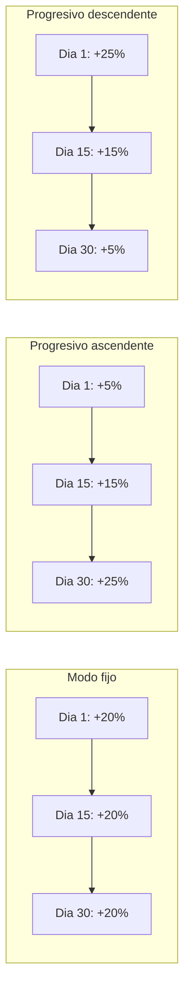

# Sistema de Tarifas Dinamicas — Agendity

> Ultima actualizacion: 2026-03-24
> Disponible desde: **Plan Profesional+**
> Sugerencias IA: **Solo Plan Inteligente**

## Resumen

Permite ajustar precios automatica o manualmente segun demanda, temporadas o dias de la semana. Soporta incrementos y descuentos, modo fijo o progresivo, y filtro por dias.

| Plan | Funcionalidad |
|---|---|
| Profesional | Crear y gestionar tarifas manualmente |
| Inteligente | Todo lo anterior + sugerencias automaticas basadas en analisis de demanda |

---

## Modelo de datos

### DynamicPricing

```sql
CREATE TABLE dynamic_pricings (
  id bigint PRIMARY KEY,
  business_id bigint NOT NULL REFERENCES businesses(id),
  service_id bigint REFERENCES services(id),  -- null = todos los servicios
  name varchar NOT NULL,
  start_date date NOT NULL,
  end_date date NOT NULL,
  price_adjustment_type integer DEFAULT 0,      -- 0=percentage, 1=fixed
  adjustment_mode integer DEFAULT 0,            -- 0=fixed_mode, 1=progressive_asc, 2=progressive_desc
  adjustment_value decimal(10,2),               -- para modo fijo
  adjustment_start_value decimal(10,2),         -- para modo progresivo
  adjustment_end_value decimal(10,2),           -- para modo progresivo
  days_of_week integer[] DEFAULT '{}',          -- vacio = todos, [0,6] = dom+sab
  status integer DEFAULT 0,                     -- 0=suggested, 1=active, 2=rejected, 3=expired
  suggested_by varchar DEFAULT 'manual',        -- 'system' | 'manual'
  suggestion_reason text,                       -- explicacion de la IA
  analysis_data jsonb DEFAULT '{}',             -- datos del analisis
  timestamps
);
```

### Campos en Appointment (tracking)

```sql
dynamic_pricing_id bigint REFERENCES dynamic_pricings(id)  -- tarifa aplicada
original_price decimal(12,2)                                 -- precio antes del ajuste
```

---

## Tipos de ajuste

### Por tipo de valor

| Tipo | Valor | Ejemplo |
|---|---|---|
| `percentage` | % sobre el precio base | +20% sobre $50,000 = $60,000 |
| `fixed` | Monto fijo sumado al precio | +$10,000 sobre $50,000 = $60,000 |

**Valores negativos = descuento:**

| Valor | Efecto |
|---|---|
| +20% | Incremento del 20% |
| -15% | Descuento del 15% |
| +10000 | Incremento de $10,000 |
| -5000 | Descuento de $5,000 |

### Por modo de aplicacion



| Modo | Campos usados | Calculo |
|---|---|---|
| `fixed_mode` | `adjustment_value` | Mismo valor todos los dias |
| `progressive_asc` | `adjustment_start_value`, `adjustment_end_value` | Interpola linealmente de start a end |
| `progressive_desc` | `adjustment_start_value`, `adjustment_end_value` | Interpola linealmente de start a end |

### Formula de interpolacion progresiva

```ruby
progress = (date - start_date) / (end_date - start_date)  # 0.0 a 1.0
adjustment = start_value + (end_value - start_value) * progress
```

**Ejemplo:** Del 1 al 31 dic, progresivo +10% a +25%:
- 1 dic: +10% (progress=0.0)
- 15 dic: +17.5% (progress=0.5)
- 31 dic: +25% (progress=1.0)

### Filtro por dia de la semana

| `days_of_week` | Efecto |
|---|---|
| `[]` (vacio) | Aplica todos los dias |
| `[6, 0]` | Solo sabados y domingos |
| `[5]` | Solo viernes |

---

## Aplicacion del precio

Cuando se crea una cita, `CreateAppointmentService` verifica:

```ruby
# 1. Buscar tarifa activa para la fecha y servicio
active_pricing = business.dynamic_pricings
  .for_date(date)
  .where("service_id = ? OR service_id IS NULL", service.id)
  .order("service_id IS NOT NULL DESC")  # servicio especifico primero
  .first

# 2. Verificar que aplica al dia de la semana
if active_pricing&.applies_on_day?(date)
  final_price = active_pricing.apply_to_price(base_price, date)
  appointment.original_price = base_price
  appointment.dynamic_pricing_id = active_pricing.id
end
```

**Prioridad:** tarifa especifica de servicio > tarifa general (service_id NULL).

---

## API Endpoints

Todos requieren auth JWT + Plan Profesional+.

### GET /api/v1/dynamic_pricing

```bash
curl -H "Authorization: Bearer $TOKEN" \
  "http://localhost:3001/api/v1/dynamic_pricing"

# Filtrar por status
curl -H "Authorization: Bearer $TOKEN" \
  "http://localhost:3001/api/v1/dynamic_pricing?status=suggested"
```

### POST /api/v1/dynamic_pricing

```bash
# Modo fijo: +20% todo diciembre
curl -X POST -H "Authorization: Bearer $TOKEN" \
  -H "Content-Type: application/json" \
  -d '{
    "dynamic_pricing": {
      "name": "Temporada navidena",
      "start_date": "2026-12-01",
      "end_date": "2026-12-31",
      "price_adjustment_type": "percentage",
      "adjustment_mode": "fixed_mode",
      "adjustment_value": 20
    }
  }' \
  "http://localhost:3001/api/v1/dynamic_pricing"

# Progresivo: +10% a +25% en diciembre
curl -X POST -H "Authorization: Bearer $TOKEN" \
  -H "Content-Type: application/json" \
  -d '{
    "dynamic_pricing": {
      "name": "Navidad progresivo",
      "start_date": "2026-12-01",
      "end_date": "2026-12-31",
      "price_adjustment_type": "percentage",
      "adjustment_mode": "progressive_asc",
      "adjustment_start_value": 10,
      "adjustment_end_value": 25
    }
  }' \
  "http://localhost:3001/api/v1/dynamic_pricing"

# Descuento: -15% entre semana (lun a vie)
curl -X POST -H "Authorization: Bearer $TOKEN" \
  -H "Content-Type: application/json" \
  -d '{
    "dynamic_pricing": {
      "name": "Descuento entre semana",
      "start_date": "2026-04-01",
      "end_date": "2026-04-30",
      "price_adjustment_type": "percentage",
      "adjustment_mode": "fixed_mode",
      "adjustment_value": -15,
      "days_of_week": [1,2,3,4,5]
    }
  }' \
  "http://localhost:3001/api/v1/dynamic_pricing"
```

### PATCH /api/v1/dynamic_pricing/:id/accept (Plan Inteligente)

Acepta una sugerencia del sistema y la activa.

### PATCH /api/v1/dynamic_pricing/:id/reject (Plan Inteligente)

Rechaza una sugerencia.

### DELETE /api/v1/dynamic_pricing/:id

Elimina una tarifa.

---

## Analisis de demanda (DemandAnalysisService)

### Fase actual: Queries SQL

El servicio analiza datos historicos con 4 estrategias. Los nombres de meses se generan en **espanol** (`MONTH_NAMES_ES`).

#### Constantes de umbrales

| Constante | Valor | Significado |
|---|---|---|
| `HIGH_DEMAND_THRESHOLD` | 0.7 | Ocupacion >= 70% → mes de alta demanda |
| `LOW_DEMAND_THRESHOLD` | 0.5 | 50% por debajo del promedio → mes bajo |
| `ABOVE_AVG_THRESHOLD` | 1.3 | 30% por encima del promedio → mes alto |
| `WEEKEND_DIFF_THRESHOLD` | 1.3 | 30% mas en fines de semana que entre semana |

#### 1. Patrones mensuales (ocupacion absoluta)

```sql
SELECT EXTRACT(MONTH FROM appointment_date) as month, COUNT(*)
FROM appointments
WHERE appointment_date >= NOW() - INTERVAL '12 months'
  AND status != 'cancelled'
GROUP BY month
```

- Compara cada mes vs capacidad estimada (empleados activos x slots por dia x 26 dias)
- Si ocupacion >= 70% → sugiere incremento proporcional (10-30%)
- Nombre de sugerencia: `"Temporada alta — Diciembre"` (en espanol)

#### 2. Demanda relativa (meses bajos Y altos vs promedio del negocio)

Requiere minimo 3 meses de datos historicos.

```ruby
avg = monthly_data.values.sum / monthly_data.size.to_f

# Mes bajo: ratio <= 0.5 (50% o menos del promedio)
# → sugiere DESCUENTO para atraer clientes
discount = clamp(pct_below / 3, 5, 20)  # max 20% de descuento
# Nombre: "Promocion — Febrero"
# Razon: "Febrero tiene X% menos citas que el promedio. Sugerimos descuento del Y%"

# Mes alto: ratio >= 1.3 (30% o mas del promedio)
# → sugiere INCREMENTO moderado
increase = clamp(pct_above / 3, 5, 15)  # max 15% de incremento
# Nombre: "Alta demanda — Julio"
# Razon: "Julio tiene X% mas citas que el promedio. Sugerimos incremento del Y%"
```

El `target_year` se calcula correctamente: si el mes ya paso en el año actual, la sugerencia se genera para el siguiente año.

#### 3. Fin de semana vs entre semana

```sql
SELECT EXTRACT(DOW FROM appointment_date) as dow, COUNT(*)
FROM appointments
WHERE appointment_date >= NOW() - INTERVAL '3 months'
GROUP BY dow
```

- Si weekend_avg > weekday_avg * 1.3 → sugiere premium fines de semana
- Nombre: `"Premium fin de semana"`

#### 4. Temporada navidena

- Compara diciembre historico vs promedio mensual del ultimo año
- Si diciembre > promedio * 1.4 → sugiere incremento progresivo 10% a 25% (modo `progressive_asc`)
- Nombre: `"Temporada navidena"`

### Job: PricingSuggestionJob

```yaml
# config/recurring.yml
pricing_suggestions:
  class: Intelligence::PricingSuggestionJob
  schedule: every 1st and 15th at 8am
```

- Solo ejecuta para negocios con Plan Inteligente (`ai_features: true`)
- Requiere minimo 30 citas historicas
- Genera notificacion in-app + evento NATS cuando hay sugerencias

---

## Escalamiento a IA real (Claude API) — Guia futura

### Fase actual vs Fase IA

| Aspecto | Fase 1 (actual) | Fase 2 (futura) |
|---|---|---|
| **Motor** | Queries SQL + reglas | Claude API |
| **Patron** | Umbrales predefinidos (70%, 1.3x) | Analisis contextual |
| **Sugerencias** | Templates fijos | Lenguaje natural personalizado |
| **Costo** | $0 | API calls (~$0.01-0.05 por analisis) |
| **Latencia** | <100ms | ~2-5s |

### Como migrar a Claude API

**1. Preparar el contexto:**
```ruby
# Recopilar datos del negocio
context = {
  business_type: business.business_type,
  city: business.city,
  monthly_appointments: monthly_data,      # hash {month => count}
  daily_pattern: daily_data,               # hash {dow => count}
  avg_price: business.services.average(:price),
  employee_count: business.employees.active.count,
  current_pricings: business.dynamic_pricings.active.map(&:attributes)
}
```

**2. Llamar a Claude API:**
```ruby
client = Anthropic::Client.new
response = client.messages.create(
  model: "claude-sonnet-4-20250514",
  max_tokens: 1000,
  system: "Eres un analista de precios para negocios de belleza en Colombia. " \
          "Analiza los datos y sugiere tarifas dinamicas especificas.",
  messages: [{
    role: "user",
    content: "Datos del negocio:\n#{context.to_json}\n\n" \
             "Genera sugerencias de tarifas dinamicas en formato JSON con: " \
             "name, start_date, end_date, adjustment_mode, values, reason."
  }]
)
```

**3. Parsear respuesta y crear sugerencias:**
```ruby
suggestions = JSON.parse(response.content[0].text)
suggestions.each { |s| create_suggestion(s.merge(suggested_by: "ai")) }
```

### Beneficios de Claude API sobre queries:

- **Contexto cultural:** Detecta festivos colombianos, eventos locales (Feria de Cali, Carnaval de Barranquilla)
- **Patrones sutiles:** Correlaciones no obvias (ej: lluvia reduce demanda)
- **Redaccion:** Explica las sugerencias en lenguaje natural comprensible
- **Adaptabilidad:** Mejora sin cambiar codigo, solo ajustando el prompt

### Variable de entorno requerida (futura):
```env
ANTHROPIC_API_KEY=sk-ant-...
```

### Recomendacion de implementacion:

1. Mantener queries como fallback (si API falla, usa las reglas)
2. Cache de resultados por 24h (no re-analizar si ya se hizo hoy)
3. Rate limit: maximo 1 analisis por negocio cada 15 dias
4. Log de cada llamada para monitorear costos

---

## Frontend

### Pagina /dashboard/dynamic-pricing

**Plan Profesional:**
- Lista de tarifas activas
- Boton "Nueva tarifa" con formulario completo
- Formulario: nombre, servicio, fechas, tipo, modo, valores, preview, filtro dias

**Plan Inteligente (adicional):**
- Seccion "Sugerencias inteligentes" con icono Sparkles (IA)
- Cards de sugerencias con explicacion, aceptar/rechazar
- Las sugerencias generadas por el sistema tienen icono de IA

### Formulario de creacion

Campos:
1. Nombre
2. Servicio (o "Todos")
3. Fecha inicio / fin
4. Tipo: Porcentaje o Monto fijo
5. Modo: Fijo / Progresivo ascendente / Progresivo descendente
6. Valor(es) — acepta negativos para descuentos
7. Preview de precio ajustado
8. Dias de la semana (opcional)

---

## Servicios

| Servicio | Responsabilidad |
|---|---|
| `Intelligence::DemandAnalysisService` | Analiza datos con queries SQL, genera sugerencias |
| `Intelligence::PricingSuggestionJob` | Job quincenal, ejecuta analisis para Plan Inteligente |
| `DynamicPricingController` | CRUD + accept/reject, plan enforcement |
| `CreateAppointmentService` | Aplica tarifa activa al crear cita |
